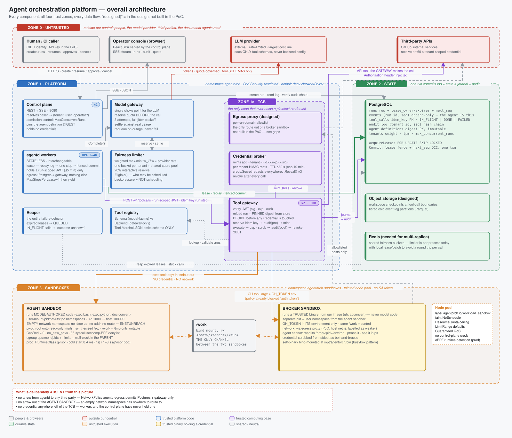

# 00 · Overall architecture

> Spec: [`gen/d00_overall.py`](gen/d00_overall.py) · Reasoning: [runtime model](../reasoning/01-runtime-model.md), [isolation](../reasoning/02-isolation.md), [authorization](../reasoning/05-authorization.md)

## What this shows

Every component in the system, every trust boundary, and every data flow that
exists. Four zones, numbered by trust:

| Zone | What it contains | What enforces it |
|---|---|---|
| **0 · Untrusted** | people, the browser, the LLM provider, third-party APIs, the documents agents read | nothing — by definition we control none of it |
| **1 · Platform** | control plane, workers, model gateway, fairness limiter, tool registry, reaper | Kubernetes namespace `agentorch`, Pod Security *restricted*, default-deny NetworkPolicy |
| **1a · TCB** | tool gateway, credential broker, egress proxy | the only Deployment with a ServiceAccount; the only code that calls `Reveal()` |
| **2 · State** | Postgres (+ object storage, Redis in the design) | a NetworkPolicy that admits exactly three client Deployments and initiates nothing |
| **3 · Sandboxes** | the agent sandbox and the broker sandbox, joined by `/work` | namespace `agentorch-sandboxes`, RuntimeClass gVisor, tainted node pool, deny-all NetworkPolicy, no ServiceAccount token |

## Services

Nine processes exist; only three are separate Deployments. The single Go binary
(`agentorch`) dispatches on its subcommand and on `argv[0]`:

| Service | Process | Replicas | Listens | Talks to |
|---|---|---|---|---|
| Control plane | `agentorch serve` (api) | 2 | :8080 | Postgres |
| agentd workers | `agentorch serve` (worker loop) | 3, HPA 2–40 | — | Postgres, tool gateway |
| Reaper | goroutine in every worker/API replica | n | — | Postgres |
| Model gateway + fairness limiter | in-process in agentd | — | — | LLM provider |
| Tool gateway | `agentorch serve` (gateway) | 2, PDB | :8081 | Postgres, sandboxes, third parties |
| Credential broker | in-process in the gateway | — | — | — |
| Tool registry | in-process (schema/backend split) | — | — | — |
| Agent sandbox | `agentorch` re-exec'd as init | per call | — | nothing |
| Broker sandbox | `agentorch` as `gh` (argv[0]) | per call | — | GitHub via egress |

In the PoC one process can run all three roles (`agentorch serve` starts api +
worker + gateway); the manifests split them so their NetworkPolicies and
ServiceAccounts differ. That split is the point: **the worker has no route to
the internet, and the gateway is the only thing that does.**

## Domain boundaries

Each zone owns one kind of decision and nothing else:

* **Control plane** decides *who* and *what*: resolves the caller to a tenant,
  admits or rejects the run, pins the agent definition digest. It never decides
  what a tool call may do and never sees a credential.
* **Workers** decide *what happens next*: replay the log, ask the model, emit
  tool calls. They cannot authorise anything — the gateway ignores what a worker
  claims and reloads the run from the store.
* **Tool gateway** decides *whether* and *how* a tool call happens. It is the only
  place that maps "the model wants X" to "X is executed with credential Y in
  sandbox Z".
* **Store** decides *ordering and ownership*: which worker holds a run, what the
  next sequence number is, whether an idempotency key is fresh.
* **Sandboxes** decide nothing. They are where decisions already made are
  carried out, with as little ambient authority as Linux allows.

The boundary that matters most is between 1 and 1a. Blue code can be wrong
without a credential leaking; purple code cannot. Keeping the purple set small —
three processes, ~1 500 lines — is what makes it reviewable.

## Data flow, end to end

1. A caller `POST`s a run. The control plane writes one row and one event in one
   transaction. Nothing else happens. (green line api → pg)
2. A worker's `AcquireLease` query finds the row, takes a lease, replays the
   event log into a model context, and calls the model through the model
   gateway, which reserves fairness quota first. (green agentd → pg, red modelgw
   → llm)
3. The model returns tool calls. The worker POSTs each to the gateway with a
   run-scoped JWT and a deterministic idempotency key. (purple agentd → gw)
4. The gateway reloads the run and its pinned definition, decides, journals,
   audits, and only then mints a credential and executes — in the agent sandbox
   (orange), in the broker sandbox (amber), or in its own process for API tools
   (purple to the third party). (purple gw → pg; orange gw → sandboxes)
5. The result comes back; the worker commits `TOOL_CALL`/`TOOL_RESULT` events
   under its fence and loops.
6. The browser watches all of it over SSE, rebuilt from the same events.

## Failure handling

The overall picture has exactly one failure detector and one recovery path,
which is why it is drawn once and not per component:

* every worker death, pause or partition ends in **a lease that expires** →
  the reaper re-queues the row → another worker replays. Diagram 02.
* every gateway death mid-call ends in **a journal row stuck IN_FLIGHT** → the
  reaper marks it "outcome unknown" → the model is told the truth. Diagram 03.
* every provider outage ends in **a run re-queued with `wake_at`**, never a
  failed run. Diagram 06.
* every sandbox misbehaviour ends in **the parent killing the cgroup**.
  Diagram 04.

Diagram 09 is the complete matrix.

## Optimisations that shape the picture

* **No broker, no lock service, no cache.** Postgres is the queue
  (`FOR UPDATE SKIP LOCKED`), the lock (lease columns), the event store and the
  journal. One fewer system per box removed is one fewer consistency seam the
  fencing argument has to cross.
* **Backpressure is not scheduling.** The fairness limiter's `Eligible()` is
  pushed into the lease query's `WHERE` clause. A tenant that is out of quota is
  never even selected; no worker ever blocks.
* **Sandboxes are per call, not per agent**, because the measured cold start is
  8.4 ms. An agent that is 99.9 % idle waiting on a model does not hold a
  process, a pod or a socket.
* **One binary, one image.** The console, the API, the worker, the gateway and
  the sandbox init are all `agentorch`; the CLI shim inside the broker sandbox is
  the same file bind-mounted under another name.

## Trade-offs

| Chosen | Instead of | What it costs |
|---|---|---|
| a stateless worker pool over a log | a pod per agent | replay cost grows with log length (checkpoints are designed, not built) |
| authorisation at a network hop | a library inside the worker | +1 RPC per tool call; the gateway is on every hot path (hence PDB + 2 replicas) |
| Postgres for everything durable | a queue + a KV lock + an event store | write throughput is one primary; tiering to object storage is the designed escape |
| gVisor in production, namespaces in the PoC | Kata / Firecracker | gVisor's syscall overhead and 1–3 s pod starts; microVMs would be stronger but need nested virt or bare metal |
| containment over injection detection | a classifier in the loop | agents need explicit grants and allowlists; nothing is "smart" about a denied call |

## What is deliberately absent

Three arrows are not in the picture and cannot be added without changing a
manifest or a syscall:

1. **agentd → any third party.** `NetworkPolicy agentd-egress` permits Postgres
   and the gateway only.
2. **agent sandbox → anywhere.** An empty network namespace has no route; the
   failure is `ENETUNREACH` before a packet exists.
3. **a credential left of the TCB.** Workers and the control plane have never
   held one; there is no code path that hands them one.

## Where to look in the code

| Area | Path |
|---|---|
| control plane | [`backend/internal/api/`](../../backend/internal/api/) |
| worker loop, reaper | [`backend/internal/runtime/`](../../backend/internal/runtime/) |
| store, schema | [`backend/internal/store/`](../../backend/internal/store/) |
| gateway, authz, tools | [`backend/internal/gateway/`](../../backend/internal/gateway/), [`authz/`](../../backend/internal/authz/), [`tools/`](../../backend/internal/tools/) |
| sandbox | [`backend/internal/sandbox/`](../../backend/internal/sandbox/) |
| credentials | [`backend/internal/creds/`](../../backend/internal/creds/) |
| model gateway, fairness | [`backend/internal/llm/`](../../backend/internal/llm/), [`fairness/`](../../backend/internal/fairness/) |
| manifests | [`deploy/k8s/base/`](../../deploy/k8s/base/) |
