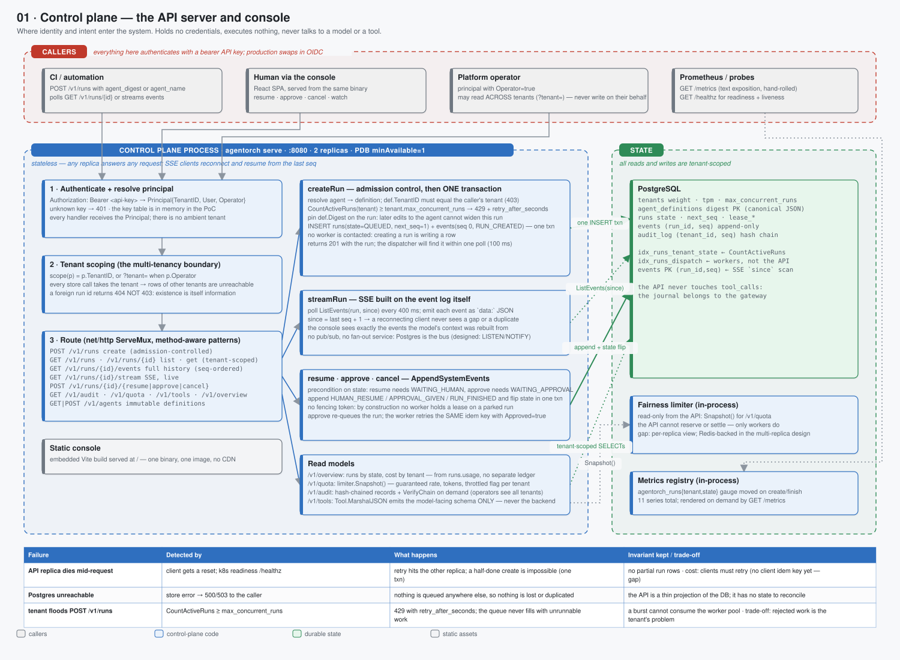

# 01 · Control plane — the API server and console



> Spec: [`gen/d01_control_plane.py`](gen/d01_control_plane.py) · Code: [`backend/internal/api/api.go`](../../backend/internal/api/api.go) · Reasoning: [runtime model](../reasoning/01-runtime-model.md), [authorization](../reasoning/05-authorization.md)

## What this shows

The process that callers and operators talk to. It is deliberately boring: it
authenticates, scopes to a tenant, and reads or writes rows. It does not run
agents, does not call models, does not call tools, and does not hold a
credential. Everything interesting that a run does happens after the control
plane has returned `201 Created`.

## Services

One Deployment, two replicas, one Service on :8080, a PodDisruptionBudget of
`minAvailable: 1`. It serves:

| Surface | Handler | Notes |
|---|---|---|
| `POST /v1/runs` | `createRun` | admission control, digest pinning, one transaction |
| `GET /v1/runs`, `GET /v1/runs/{id}` | `listRuns`, `getRun` | tenant-scoped; `limit` clamped to a maximum, not silently reset to the default (bug B7) |
| `GET /v1/runs/{id}/events` | `getEvents` | the full log, seq-ordered |
| `GET /v1/runs/{id}/stream` | `streamRun` | SSE, polling `ListEvents(since)` every 400 ms |
| `POST /v1/runs/{id}/{resume,approve,cancel}` | human actions | `AppendSystemEvents`, state precondition |
| `GET /v1/agents`, `POST /v1/agents` | definitions | content-addressed, immutable |
| `GET /v1/audit`, `/v1/quota`, `/v1/tools`, `/v1/overview`, `/v1/tenants` | read models | operator views |
| `GET /metrics`, `GET /healthz` | scrape + probes | hand-rolled Prometheus text |
| `/` | static console | the Vite build embedded in the binary |

The router is Go 1.22+'s `net/http.ServeMux` with method-aware patterns. There
is no framework.

## Domain boundaries

**Identity → principal.** `Authorization: Bearer <key>` resolves to a
`Principal{TenantID, User, Operator}`. The key table is in memory in the PoC;
production swaps in OIDC (the only change is how the principal is built). Every
handler receives the principal explicitly — there is no ambient "current
tenant" in a context value that a handler could forget to check.

**Principal → scope.** `scope(p)` returns `p.TenantID`, or the `?tenant=` query
parameter when `p.Operator` is true. Every store call takes the tenant. A run id
from another tenant returns **404, not 403**: existence is information, and a
403 would let a caller enumerate other tenants' run ids.

**What the control plane may write.** Exactly four things: a new run (with its
first event), a new agent definition, a human-action event on a *parked* run,
and metrics. It never writes to `tool_calls` (that is the gateway's journal) and
never touches the lease columns (those belong to workers and the reaper).

## Data flow

### createRun — admission control, then one transaction

```
resolve agent (digest or name) → def
def.TenantID == p.TenantID  or  p.Operator          else 403
active = CountActiveRuns(tenant)
active >= tenant.max_concurrent_runs                  → 429 + retry_after_seconds
run := {id, tenant, def.Digest, budget, priority, state QUEUED}
CreateRun(run, RUN_CREATED{input})                    -- one INSERT txn, next_seq = 1
201 run
```

Three properties fall out of this:

* **Pinning.** The run records `def.Digest`. Editing the agent later creates a
  new digest; the running agent keeps the old one. The gateway loads the
  definition by the run's digest, so grants cannot be widened retroactively.
* **Admission before queueing.** A tenant that spins 300 agents at 09:00 gets a
  clear 429 for the ones beyond its cap rather than a queue that never drains.
  Rejected work is the tenant's problem to retry; accepted work is ours to
  finish.
* **No worker contact.** Creating a run is writing a row. The dispatcher finds
  it on its next poll (≤ 100 ms). If every worker is dead the row waits; nothing
  is lost.

### streamRun — SSE from the event log

The stream is the log. Every 400 ms the handler calls `ListEvents(run, since)`,
writes each event as an SSE `data:` frame, and advances `since = seq + 1`. A
client that reconnects passes its last seq and sees no gap and no duplicate.
There is no pub/sub layer, no fan-out service, no separate telemetry stream —
which is why the console cannot disagree with the model about what happened.

### resume · approve · cancel — AppendSystemEvents

Each checks a state precondition (`resume` needs `WAITING_HUMAN`, `approve`
needs `WAITING_APPROVAL`), appends the corresponding event and flips the state
to `QUEUED` (or `CANCELLED`) in one transaction. No fencing token is taken:
**by construction no worker holds a lease on a parked run**, so the API is the
only writer. `approve` re-queues the run and the worker retries the same
`run:step:i` idempotency key with `approved=true` — the gateway's journal has no
row yet because approval is decided before the key is reserved.

## Failure handling

| Failure | Detection | Consequence | Invariant kept |
|---|---|---|---|
| replica dies mid-request | client reset; readiness probe | the other replica serves the retry | a half-created run is impossible: one transaction |
| Postgres unreachable | store error → 500/503 | nothing is queued anywhere else | the API has no state to reconcile |
| tenant floods `POST /v1/runs` | `CountActiveRuns ≥ cap` | 429 with `retry_after_seconds` | the worker pool is never consumed by one tenant |
| SSE client disconnects | write error | handler returns; nothing to clean up | reconnect with `since` |
| bad agent name / digest | `resolveAgent` error | 400 | no run row is created |

**Known gap:** `POST /v1/runs` has no client-supplied idempotency key, so a
caller that times out and retries can create two runs. The fix is a
`Idempotency-Key` header stored on the run row with a unique index — the same
pattern the gateway already uses for tool calls.

## Optimisations

* **The console is embedded.** One binary, one image, no CDN, no CORS. The Vite
  build is compiled in with `embed`; the SPA and the API share an origin.
* **Reads are indexed for the console.** `idx_runs_tenant_state` serves
  `CountActiveRuns` and the overview; the events primary key `(run_id, seq)`
  serves SSE's `since` scan without a sort.
* **Admission is one `COUNT`.** It is checked before the insert and is not
  transactional with it; two concurrent creates can both pass the check and
  exceed the cap by one. That is accepted: the cap is a fairness tool, not a
  security boundary.

## Trade-offs

| Chosen | Instead of | Cost |
|---|---|---|
| SSE by polling Postgres | LISTEN/NOTIFY, a websocket hub, Kafka | 400 ms latency floor; read load proportional to open consoles (designed fix: NOTIFY or a read replica) |
| bearer API keys in memory | OIDC / JWT from an IdP | production must swap this; the principal type is the seam |
| 404 for foreign runs | 403 | operators debugging cross-tenant issues must use `?tenant=` explicitly |
| admission by count | a per-tenant queue | the check is not transactional; can overshoot by one under a race |

## Where to look in the code

* [`api.go`](../../backend/internal/api/api.go) — routes, principal resolution, every handler
* [`store.go`](../../backend/internal/store/store.go) — the `Store` interface the API depends on
* [`ui/src/`](../../ui/src/) — the console; `api.ts` mirrors the routes above
* Tests: `TestListRuns_OverMaxLimitReturnsMaximumNotDefault`, `TestLease_RespectsEligibleTenants` (store conformance), the end-to-end demo (`make demo`)
