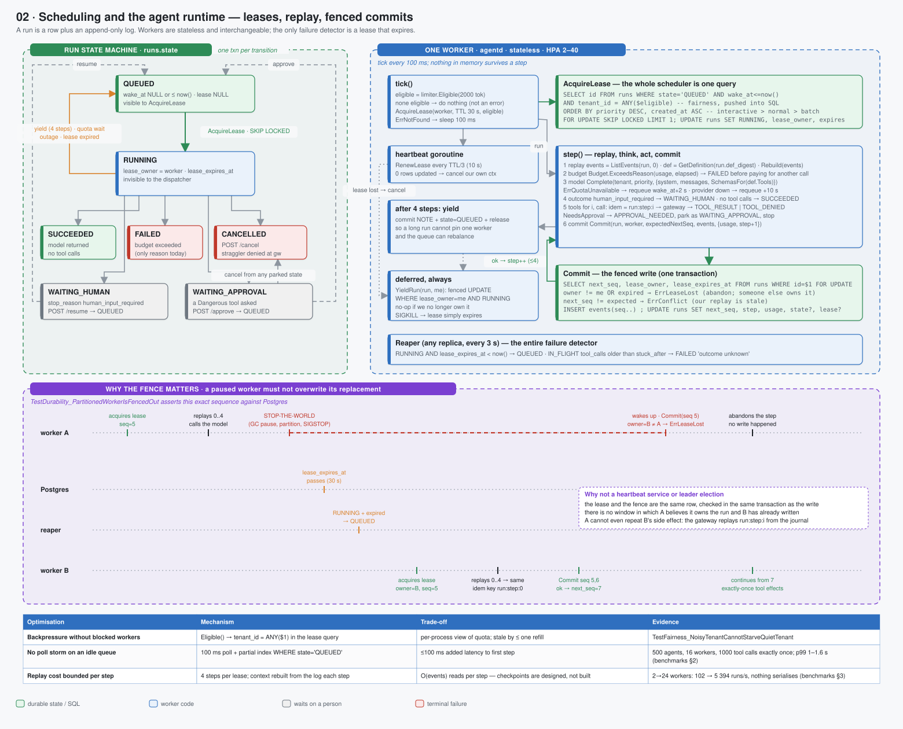

# 02 · Scheduling and the agent runtime — leases, replay, fenced commits



> Spec: [`gen/d02_scheduling_runtime.py`](gen/d02_scheduling_runtime.py) · Code: [`backend/internal/runtime/worker.go`](../../backend/internal/runtime/worker.go), [`reaper.go`](../../backend/internal/runtime/reaper.go), [`store/postgres.go`](../../backend/internal/store/postgres.go) · Reasoning: [runtime model](../reasoning/01-runtime-model.md), [durability substrate](../reasoning/03-durability-substrate.md), [scheduling](../reasoning/04-scheduling.md)

## What this shows

Three things that are usually three systems, drawn as one because here they are
one:

1. the **run state machine** (left) — seven states, every transition one
   Postgres transaction;
2. **one worker's loop** (right) — lease, replay, step, fenced commit, yield;
3. **why the fence matters** (bottom) — the timeline in which a paused worker
   wakes up and is refused, which is the exact sequence
   `TestDurability_PartitionedWorkerIsFencedOut` asserts.

## Services

* **agentd** — a Deployment of identical, stateless workers (3 replicas, HPA
  2–40 on CPU). Each runs `Worker.Run`: a 100 ms tick that tries to lease one
  run and, if it gets one, advances it up to four steps.
* **Reaper** — a goroutine (any replica, every 3 s as wired in `serve.go`; the package default is 5 s) that runs two `UPDATE`
  statements. It is the platform's entire failure detector.
* **Postgres** — the queue, the lock and the log. `AcquireLease` *is* the
  scheduler.

## Domain boundaries

**A run is a row plus a log, not a process.** `runs` holds the mutable summary
(state, `next_seq`, usage, lease); `events` holds the append-only history. The
model's context is `Rebuild(events)` — nothing the worker remembers from a
previous step is trusted, so a worker can be replaced between any two steps by
any other worker on any node.

**The worker owns nothing durable.** It owns a lease, which is a claim with an
expiry. Every write it makes is conditional on still holding that claim
(`lease_owner = me AND lease_expires_at > now()`) and on the log being where it
thinks it is (`next_seq = expected`). Those two predicates are the whole
consistency model.

**The reaper owns liveness.** No heartbeat service, no membership protocol, no
leader election: a worker that stops renewing its lease loses it after at most
one TTL, and the reaper's `UPDATE … WHERE lease_expires_at < now()` puts the run
back on the queue. Because the check is against the database's clock, worker
clock skew cannot matter.

## Data flow: one step

```
tick:      eligible = limiter.Eligible(2000)          -- tenants that can afford a typical call
           run = AcquireLease(me, TTL 30 s, eligible) -- SELECT … FOR UPDATE SKIP LOCKED LIMIT 1
heartbeat: RenewLease every TTL/3; 0 rows → cancel our own context
step:
  1 replay   events = ListEvents(run, 0); def = GetDefinition(run.def_digest); msgs = Rebuild(events)
  2 budget   Budget.ExceedsReason(usage, elapsed) → FAILED before paying for another call
  3 model    resp = modelgw.Complete(tenant, priority, {system, msgs, SchemasFor(def.Tools)})
             ErrQuotaUnavailable → requeue wake_at = now+2 s
             provider unavailable after retries → requeue wake_at = now+10 s
  4 outcome  human_input_required → HUMAN_PAUSE, WAITING_HUMAN, release
             no tool calls → RUN_FINISHED, SUCCEEDED, release
  5 tools    for i, call: idem = run:step:i
               TOOL_CALL event; POST to gateway; TOOL_RESULT | TOOL_DENIED event
               NeedsApproval → APPROVAL_NEEDED, WAITING_APPROVAL, release, stop
  6 commit   Commit(run, me, expectedNextSeq, events, {usage, step+1})
             ErrLeaseLost → abandon silently (someone else owns it)
after 4 steps: commit NOTE + state QUEUED + release   (yield)
deferred:      YieldRun(run, me) — fenced UPDATE, no-op if we no longer own it
```

### The lease query

```sql
SELECT id FROM runs
WHERE state = 'QUEUED'
  AND (wake_at IS NULL OR wake_at <= now())
  AND (lease_expires_at IS NULL OR lease_expires_at < now())
  AND ($1::text[] IS NULL OR cardinality($1::text[]) = 0 OR tenant_id = ANY($1))
ORDER BY CASE priority WHEN 'interactive' THEN 2 WHEN 'normal' THEN 1 ELSE 0 END DESC,
         created_at ASC
FOR UPDATE SKIP LOCKED
LIMIT 1;
UPDATE runs SET state = 'RUNNING', lease_owner = $2, lease_expires_at = now() + ttl WHERE id = …;
```

`SKIP LOCKED` is what lets N workers poll the same table without blocking each
other or a broker: each takes a different row. The `tenant_id = ANY($1)` clause
is the fairness limiter's decision, pushed into SQL (bug B4 was the
`cardinality(NULL)` edge case in exactly this clause). The partial index
`WHERE state = 'QUEUED'` keeps the query tiny regardless of how much finished
history accumulates.

### The fenced commit

```sql
SELECT next_seq, lease_owner, lease_expires_at FROM runs WHERE id = $1 FOR UPDATE;
-- owner ≠ me OR expired   → ROLLBACK, ErrLeaseLost
-- next_seq ≠ expected     → ROLLBACK, ErrConflict
INSERT INTO events (run_id, seq, type, payload) VALUES …;   -- seq, seq+1, …
UPDATE runs SET next_seq = seq + n, step = …, usage = …, [state], [lease_owner = NULL], [wake_at];
```

This is the fencing-token argument from Kleppmann's *How to do distributed
locking*: the lock (lease) and the write are checked in the same transaction
against a row-level lock, so there is no window in which a stale holder can
write after a new holder has.

## Failure handling

| Failure | What notices | Recovery | Bound |
|---|---|---|---|
| worker SIGKILL mid-step | lease stops renewing | reaper → QUEUED → another worker replays; in-memory partial step lost (it was never written) | ≤ TTL 30 s + reaper 3 s |
| worker SIGTERM (rolling deploy) | context cancelled | deferred fenced `YieldRun` → QUEUED immediately (`TestDurability_RollingDeployLosesNoWork`) | ≈ 0 |
| worker paused (GC, SIGSTOP, partition) | its own `Commit` | fence → `ErrLeaseLost` → abandon; the replacement's writes stand | at commit |
| run stuck RUNNING with no owner | reaper's second clause (`lease_owner IS NULL AND updated_at < now() − 60 s`) | re-queued | 60 s |
| step exceeds the per-lease budget | loop counter | explicit commit to QUEUED with a NOTE (bug B6: dropping the lease without flipping the state made the run invisible to both dispatcher and reaper forever) | — |
| provider outage | model gateway error | requeue with `wake_at`; never FAILED | 10 s + outage |
| budget exhausted | `ExceedsReason` at step start | FAILED with the reason, before another model call is paid for | — |

The timeline at the bottom of the diagram is the non-obvious case: worker A is
paused *after* replaying and *before* committing; the lease expires; B takes
over, replays to the same point, produces the **same** idempotency key
`run:step:0`, and commits. When A wakes and commits, the row's `lease_owner` is
B, so A's transaction is rolled back and A writes nothing. A cannot even repeat
B's side effect, because the gateway would find `run:step:0` in its journal.

## Optimisations

| Optimisation | Mechanism | Trade-off |
|---|---|---|
| backpressure without blocked workers | `Eligible()` → `tenant_id = ANY($1)` | per-process view of quota, stale by ≤ one refill interval |
| no poll storm | 100 ms tick + partial index | ≤ 100 ms added latency to a run's first step |
| priority lanes | `ORDER BY priority DESC, created_at` | a starving batch run has no ageing; interactive work can delay it indefinitely under sustained load |
| bounded lease holding | `MaxStepsPerLease = 4` then yield | 4 extra `UPDATE`s per long run; the queue can rebalance across workers |
| heartbeat at TTL/3 | `RenewLease` | a merely slow worker (a step > 30 s without renewal) would be fenced out — renewal is in a separate goroutine to prevent that |
| replay from 0 every step | `ListEvents(run, 0)` | O(events) read per step — checkpoint/summary events are designed, not built |

Evidence: 500 agents on 16 workers complete with exactly 1 000 tool calls (p99
1–1.6 s on a 4-core VM with a stubbed model); throughput rises 52.9× from 2 to
24 workers, which is what "nothing in the shared path serialises" looks like
([benchmarks §2–3](../04-evidence/01-benchmarks.md)).

## Trade-offs

| Chosen | Instead of | Cost |
|---|---|---|
| lease + reaper as the only failure detector | heartbeat service / membership / leader election | recovery latency is the TTL; a shorter TTL risks fencing slow workers |
| replay from the log each step | in-memory agent state, or a checkpointed snapshot | quadratic total read cost over a run's life; mitigated by 4-step leases and, in the design, checkpoint events |
| Postgres `SKIP LOCKED` as the queue | Kafka / SQS / Redis streams / Temporal | one primary's write throughput; no cross-region queue; but no second consistency domain |
| priority as a sort key | separate queues per priority | no ageing for batch; simple and one query |

## Where to look in the code

* [`worker.go`](../../backend/internal/runtime/worker.go) — `tick`, `executeLease`, `heartbeat`, `step`
* [`context.go`](../../backend/internal/runtime/context.go) — `Rebuild`: event log → model messages
* [`reaper.go`](../../backend/internal/runtime/reaper.go)
* [`store/postgres.go`](../../backend/internal/store/postgres.go) — `AcquireLease`, `RenewLease`, `YieldRun`, `ReapExpiredLeases`, `Commit`
* Tests: `TestLease_OnlyOneWorkerWins`, `TestCommit_RejectedAfterLeaseLost`, `TestCommit_SeqMismatchIsConflict`, `TestLease_PriorityBeatsFIFO`, `TestDurability_*`, `TestLoad_*`
