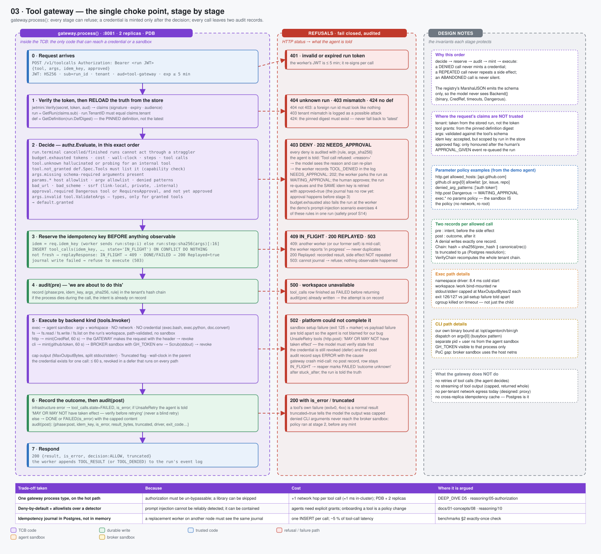

# 03 · Tool gateway — the single choke point, stage by stage

> Spec: [`gen/d03_tool_gateway.py`](gen/d03_tool_gateway.py) · Code: [`backend/internal/gateway/gateway.go`](../../backend/internal/gateway/gateway.go), [`authz/authz.go`](../../backend/internal/authz/authz.go), [`tools/`](../../backend/internal/tools/) · Reasoning: [authorization](../reasoning/05-authorization.md), [prompt injection](../reasoning/10-prompt-injection.md)

## What this shows

`gateway.process()` as a pipeline of seven stages. Every stage can refuse, and
every refusal is listed in the middle column with the HTTP status and the exact
text the agent is told. The right column carries the invariant each stage
protects. The point of the drawing is the **order**: decide → reserve →
audit → mint → execute → record. A credential is minted only after the decision
and the journal reservation, so a denied call never mints anything and a
repeated call never repeats a side effect.

## Services

One Deployment (`toolgateway`, 2 replicas, `PodDisruptionBudget minAvailable: 1`)
listening on :8081. It is the only Deployment with a ServiceAccount, because it
is the only one that creates sandbox pods. Inside the process:

| Component | Package | Role |
|---|---|---|
| HTTP handler | `gateway` | JWT check, body decode, `process()` |
| policy engine | `authz` | `Evaluate(req) → Decision{Effect, Rule, Reason}` |
| registry | `tools` | `Schema` (what the model sees) vs `Backend` (what the gateway runs) |
| invoker | `tools` | `exec` / `fs` / `http` / `cli` backends |
| credential broker | `creds` | `Mint` / `Revoke` / `Verify` |
| sandbox driver | `sandbox` | `namespace` / `docker` / `kubernetes` |
| store | `store` | run reload, journal, audit chain |

## Domain boundaries

**Nothing in the request is trusted.** The JWT names a run; the store says what
that run is currently allowed to do. The tenant comes from the stored row (a
mismatch with the token is logged as a possible attack), the grants come from
the *pinned* definition digest, the arguments are validated against the tool's
schema, and the `approved` flag is only honoured because the human's
`APPROVAL_GIVEN` event re-queued the run.

**The model never sees the backend.** `Tool.MarshalJSON` emits `Schema` only.
The binary path, the credential reference, the timeout, the `Dangerous` and
`UnsafeRetry` flags never leave the gateway process. A model cannot ask for
"the tool that has the GitHub token"; it can only ask for `github.cli` and
`pr`/`issue`/`repo` argv.

**The gateway is the only holder of a credential**, and only for the duration
of one call. The three `Reveal()` sites are inside `tools/invoke.go` and
`creds.Scrub` — see diagram 05.

## Data flow: the seven stages

| # | Stage | What happens | Refusal |
|---|---|---|---|
| 0 | request | `POST /v1/toolcalls`, `Bearer <run JWT>` (HS256, `sub=run`, `tenant`, `aud=tool-gateway`, `exp ≤ 5 min`), body `{tool, args, idem_key, approved}` | 401 invalid/expired token; 400 malformed body |
| 1 | reload | `GetRun(claims.sub)`; `run.TenantID == claims.tenant`; `GetDefinition(run.DefDigest)` | 404 unknown run; 403 tenant mismatch; 424 definition missing |
| 2 | decide | `authz.Evaluate` in order: `run.terminal` → `budget.exhausted` → `tool.unknown` → `tool.not_granted` → `args.missing` → `params.*` → `approval.required` → `default.granted`; then `tool.ValidateArgs` → `args.invalid` | 403 DENY (audited with rule + args hash); 202 NEEDS_APPROVAL |
| 3 | reserve | `idem = req.idem_key` (worker sends `run:step:i`) else `run:step:sha256(args)[:16]`; `INSERT tool_calls … 'IN_FLIGHT' ON CONFLICT DO NOTHING` | 409 still in flight; 200 replayed from the journal; 503 cannot journal |
| 4 | audit(pre) | `{phase: pre, idem_key, args_sha256, rule}` appended to the tenant's hash chain | — (a failed audit write is counted and logged; see gap below) |
| 5 | execute | by `Backend.Kind`: `exec` (agent sandbox, no network, no credential) · `fs` (workspace) · `http` (mint → header in the gateway → revoke) · `cli` (mint → broker sandbox env → scrub → revoke) | 500 workspace unavailable; 502 platform failure |
| 6 | record | `FinishToolCall(DONE|FAILED)`; `audit(post)` with `{is_error, result_bytes, truncated, driver, exit_code, credential_id…}` | — |
| 7 | respond | `200 {result, is_error, decision, truncated}`; the worker appends `TOOL_RESULT` or `TOOL_DENIED` | — |

### The parameter policy (stage 2, `params.*`)

"May call `http.get`" must not mean "may GET anything" — the first prompt
injection would exfiltrate the workspace to an attacker's domain. Per-tool
`ParamPolicy` in the agent definition adds:

* `allowed_hosts` — exact or suffix match on the URL host (`api.github.com`);
* `allowed_commands` — `argv[0]` allowlist for CLI tools (`pr`, `issue`, `repo`);
* `denied_arg_patterns` — substrings that must not appear in any argument
  (`auth token`);
* always-on SSRF checks: `http`/`https` only; no loopback, link-local
  (`169.254.0.0/16` — the cloud metadata service), private ranges, or
  `*.internal` / `metadata.google.internal` hosts;
* `requires_approval` or the tool's `Dangerous` flag → `NEEDS_APPROVAL`.

The demo's prompt-injection scenario exercises four of these rules in one run
([safety proof S14](../04-evidence/02-safety-proofs.md)).

## Failure handling

| Failure | Where | What the agent is told | Invariant |
|---|---|---|---|
| gateway crash **before** stage 3 | — | transport error; the worker records "outcome unknown" and re-sends the same key later | nothing observable happened; the retry is fresh |
| gateway crash **between** side effect and stage 6 | journal row stays `IN_FLIGHT` | reaper (`stuck_after`) marks it FAILED: *"MAY OR MAY NOT have taken effect"* | the model is told the truth instead of being invited to retry blindly |
| duplicate delivery (retry, replay by a replacement worker) | stage 3 | 409 while in flight; 200 `Replayed=true` afterwards | the side effect happens at most once |
| sandbox setup fails (our bug) | stage 5 | 502 with "the platform failed", not "your script failed" | exit 125 + marker distinguishes jail failure from payload failure |
| infrastructure error on an `UnsafeRetry` tool (`http.post`) | stage 5 | "cannot be safely retried automatically … verify the current state" | no blind retry of a non-idempotent side effect |
| workspace unavailable | stage 4→5 | 500; the journal row is finished as FAILED | audit(pre) already records the attempt |
| audit write fails | stage 4/6 | the call proceeds; `audit_write_failures_total` increments | **gap**: the design says a failed audit write should refuse the call; the PoC counts it |

## Optimisations

* **Reload, don't cache.** The run and definition are read from Postgres on
  every call (two indexed point reads). A cache would let a cancelled run keep
  calling tools until the cache expired; two reads per call is cheaper than that
  bug.
* **Deterministic idempotency keys.** `run:step:i` is computed by the worker
  from replayable state, so a replacement worker produces the *same* key
  without any coordination. The fallback `run:step:hash(args)` covers direct
  callers.
* **One audit chain per tenant, serialised by a row lock.** Throughput per
  tenant is bounded by one `INSERT` per record, which is far above any tenant's
  tool-call rate; across tenants the chains do not contend.
* **Denials are cheap.** A denied call costs two point reads and one audit
  insert — no journal row, no credential, no sandbox.

## Trade-offs

| Chosen | Instead of | Cost |
|---|---|---|
| a gateway process on the hot path | an authorization library linked into the worker | +1 RPC (~1 ms in-cluster) per tool call; the gateway must be highly available (PDB, 2 replicas) |
| deny-by-default with per-tool grants and parameter allowlists | a prompt-injection classifier | every new tool or host is a policy change; nothing is "smart" |
| journal in Postgres | an in-memory or Redis idempotency cache | one `INSERT` per call (~5 % of tool-call latency at the measured scale); survives any replica's death |
| two audit records per call | one record after the fact | 2× audit rows; but a crash mid-call still leaves evidence of intent |
| whole-result responses | streaming tool output | large outputs are capped and truncated; the model sees `truncated=true` |

## Where to look in the code

* [`gateway.go`](../../backend/internal/gateway/gateway.go) — `process()`, `replayResponse()`, `audit()`
* [`authz.go`](../../backend/internal/authz/authz.go) — `Evaluate`, `checkParams`, `parseHost`, `isBlockedIP`
* [`tools/registry.go`](../../backend/internal/tools/registry.go) — `Tool`, `Schema` vs `Backend`, `DefaultRegistry`, `ValidateArgs`
* [`tools/invoke.go`](../../backend/internal/tools/invoke.go) — `invokeExec`, `invokeFS`, `invokeHTTP`, `invokeCLI`
* [`jwtmini/`](../../backend/internal/jwtmini/) — the ~100-line HS256 JWT used for run tokens
* Tests: `TestToolCall_IdempotencyPreventsSecondSideEffect`, `TestToolCall_StuckCallsAreReapedAsAmbiguous`, `TestAudit_ChainIsTamperEvident`, the demo's 21 assertions
