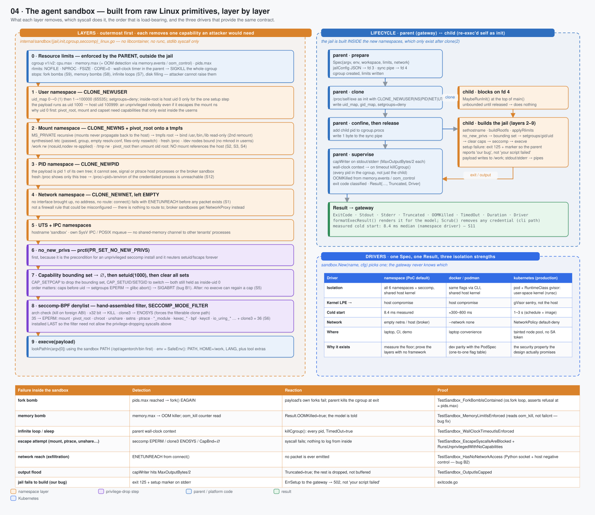

# 04 · The agent sandbox — from raw Linux primitives, layer by layer



> Spec: [`gen/d04_sandbox.py`](gen/d04_sandbox.py) · Code: [`backend/internal/sandbox/`](../../backend/internal/sandbox/) · Reasoning: [isolation](../reasoning/02-isolation.md) · Concept: [Linux isolation](../01-concepts/01-linux-isolation.md) · Reference: [syscall denylist](../05-reference/02-syscalls.md)

## What this shows

The agent sandbox as ten layers, outermost first, each removing one capability
an attacker would need; the parent/child handshake that builds it; and the three
drivers that provide the same `Spec → Result` contract at three isolation
strengths. The bottom table lists every failure inside a sandbox, how it is
detected, what the parent does, and the test that proves it.

## Services

There is no sandbox *service*. A sandbox is a short-lived process tree created
by the tool gateway for one tool call:

| Driver | Mechanism | Cold start | Kernel LPE means | Used for |
|---|---|---|---|---|
| `namespace` | `clone(2)` with six namespace flags + cgroups + seccomp, no runtime | **8.4 ms** median (measured) | host compromise (shared kernel) | the PoC, CI, the demo; proves the layers without a framework |
| `docker` / `podman` | the same flags expressed to a daemon | ≈300–800 ms | host compromise | laptop convenience; a one-to-one flag table with the PodSpec |
| `kubernetes` | a Pod per call, `runtimeClassName: gvisor` | 1–3 s | a gVisor sentry compromise, **not** the host | production |

The gateway never knows which driver it has: `sandbox.New(name, cfg)` returns a
`Driver`, and the safety tests run against the interface.

## Domain boundaries

The sandbox is the boundary between **model-authored code** and **everything we
own**. Concretely, the payload cannot:

* see the host filesystem (own mount namespace, `pivot_root` onto a tmpfs, old
  root unmounted);
* see or signal other processes — including the broker sandbox holding a
  credential (own PID namespace, fresh `/proc`);
* send or receive a packet (own, empty network namespace);
* gain a capability (`no_new_privs`, empty bounding set, uid 1000);
* make the syscalls that escapes are built from (seccomp denylist);
* exceed its cpu, memory, pid, file-size or wall-clock budget (cgroups, rlimits,
  parent timer).

It **can** write to `/work`, which is the point: `/work` is the only channel
between the agent and the rest of the system, and everything that reads from
`/work` treats it as hostile input.

## Data flow: building the jail

The order is load-bearing; each step needs a privilege the next step removes.

```
parent (gateway process)                      child (agentorch re-exec'd as init)
────────────────────────                      ──────────────────────────────────
Spec → jailConfig JSON on fd 3; sync pipe fd 4
create cgroup; write cpu.max, memory.max, pids.max
clone(/proc/self/exe, CLONE_NEWUSER|NEWNS|NEWPID|NEWNET|NEWUTS|NEWIPC)
write uid_map (0→0 ×1, 1→100000 ×65535), gid_map, setgroups=deny
                                              MaybeRunInit(): read fd 3, block on fd 4
add child pid to cgroup.procs
write 1 byte to fd 4  ──────────────────────▶ released: limits are already in place
                                              sethostname("sandbox")
                                              buildRootfs: MS_PRIVATE; tmpfs root; bind /usr,/bin,/lib RO
                                                (bind, then remount RO — the flag is ignored on the first call)
                                                synthesised /etc; fresh /proc; /dev nodes bound (no mknod in a userns)
                                                /work rw with nosuid,nodev re-applied; /tmp rw
                                                pivot_root; chdir /; umount old root; remount / RO
                                              applyRlimits: NOFILE, NPROC, FSIZE, CORE=0
                                              1 no_new_privs        (precondition for unprivileged seccomp)
                                              2 bounding set → ∅    (needs CAP_SETPCAP, still held as uid 0)
                                              3 setgroups([]) → setgid → setuid(1000)   (needs CAP_SETUID/SETGID)
                                              4 clear all capability sets (belt and braces)
                                              5 seccomp-BPF filter  (last, so it need not allow the syscalls above)
                                              6 execve(argv)
capWriter on stdout/stderr (MaxOutputBytes/2 each)
wall-clock timer → killCgroup() (every pid, not just the child)
wait; classify exit code; read oom_kill; Result{…}
```

Two of the nine bugs found while building this were in that order: dropping
capabilities before `setuid` made `setgroups` fail with `EPERM`, which glibc
turns into `abort()` — a `SIGABRT` with no obvious cause (B1); and the first
network test passed because `/dev/tcp` is a bash-ism the shell did not have
(B2). Both are now negative controls in the test suite.

### The seccomp filter

Hand-assembled BPF, `SECCOMP_MODE_FILTER`, in order: check the audit
architecture (kill on a foreign ABI); kill anything with the x32 bit set;
`clone3` → `ENOSYS` (its flags live behind a pointer seccomp cannot inspect, so
forcing glibc's fallback to `clone` makes namespace creation filterable — the
same trick Docker uses); 35 named syscalls → `EPERM`: `mount`, `umount2`,
`pivot_root`, `chroot`, `ptrace`, `process_vm_*`, `*_module`, `kexec_*`, `bpf`,
`perf_event_open`, `add_key`/`request_key`/`keyctl`, `unshare`, `setns`,
`reboot`, `swapon`/`swapoff`, clock and quota manipulation, `personality`,
`userfaultfd`, `name_to_handle_at`/`open_by_handle_at`, `io_uring_*`. The full
list with the reason for each is in [syscalls.md](../05-reference/02-syscalls.md).

A denylist rather than an allowlist because the payload is an arbitrary
toolchain (bash, python, pandoc) whose syscall surface is not enumerable in
advance; the denylist targets what escapes are built from and is defence in
depth behind the namespaces, not the primary boundary.

## Failure handling

| Failure inside the sandbox | Detection | Reaction | Proof |
|---|---|---|---|
| fork bomb | `pids.max` → `fork()` `EAGAIN` | forks fail; parent kills the cgroup at exit | `TestSandbox_ForkBombIsContained` (an `os.fork` loop asserting refusal at ≈`pids.max` — B3 replaced a test whose shell syntax error had "passed" in 27 ms) |
| memory bomb | `memory.max` → OOM killer; `oom_kill` counter | `Result.OOMKilled = true`; the model is told | `TestSandbox_MemoryLimitIsEnforced` (reads `oom_kill`, not `failcnt`) |
| infinite loop / sleep | parent's wall-clock context | `killCgroup()`, `TimedOut = true` | `TestSandbox_WallClockTimeoutIsEnforced` |
| escape attempt | seccomp `EPERM` / `clone3` `ENOSYS` / empty bounding set | the syscall fails; nothing to log from inside | `TestSandbox_EscapeSyscallsAreBlocked`, `_RunsUnprivilegedWithNoCapabilities` |
| network reach | `connect()` → `ENETUNREACH` | no packet is ever emitted | `TestSandbox_HasNoNetworkAccess` (Python socket, plus a host negative control that must *succeed*) |
| output flood | `capWriter` at `MaxOutputBytes/2` | `Truncated = true`; the rest is dropped, not buffered | `TestSandbox_OutputIsCapped` |
| jail fails to build (our bug) | exit 125 + a marker on stderr | `ErrSetup` → gateway 502 "platform failed", not "your script failed" | `exitcode.go` |
| host `/etc` or secrets visible | — | prevented: synthesised `/etc`, empty `resolv.conf` (no internal DNS leaked) | `TestSandbox_HostFilesystemIsNotVisible` |

## Optimisations

* **Re-exec, don't fork.** Go cannot safely run code between `fork` and `exec`
  (runtime threads and locks do not survive); re-executing `/proc/self/exe` as
  the init gives a clean single-threaded start *inside* the new namespaces —
  the same shape as every container runtime.
* **Limits before release.** The child blocks on a pipe until the parent has
  placed it in the cgroup; there is no window in which the payload runs
  unbounded.
* **Kill the cgroup, not the pid.** A payload that double-forks escapes a
  `SIGKILL` to the direct child; killing every pid in the cgroup does not.
* **Per-call sandboxes.** At 8.4 ms a sandbox per tool call costs 0.35 cores at
  42 calls/s; the design uses warm per-run pods only for the gVisor driver,
  where the cold start is 1–3 s.

## Trade-offs

| Chosen | Instead of | Cost |
|---|---|---|
| raw primitives in the PoC | runc / crun / libcontainer | ~1 200 lines of privilege-sensitive Go to review; no ecosystem of hardened defaults — mitigated by the safety suite |
| gVisor in production | Kata / Firecracker microVMs | gVisor's syscall interposition overhead and incompatibilities; microVMs are stronger but need nested virtualisation or bare metal |
| shared-kernel namespaces for dev/CI | gVisor everywhere | a kernel LPE in dev is a host compromise; acceptable because dev hosts hold no tenant data |
| seccomp denylist | allowlist | a new escape primitive needs a new entry; the namespaces remain the primary boundary |
| empty network namespace | a firewall / NetworkPolicy alone | agents cannot fetch anything themselves — `http.get` through the gateway is the only way, by design |

## Where to look in the code

* [`sandbox.go`](../../backend/internal/sandbox/sandbox.go) — `Spec`, `Limits`, `Result`, `Driver`, `SafeEnv`, `HelperBinDir`
* [`jail_linux.go`](../../backend/internal/sandbox/jail_linux.go) — the parent: clone flags, cgroup, release, supervise, `killCgroup`, `capWriter`
* [`init_linux.go`](../../backend/internal/sandbox/init_linux.go) — the child: `buildRootfs`, `buildEtc`, `buildDev`, the privilege-drop order
* [`seccomp_linux.go`](../../backend/internal/sandbox/seccomp_linux.go) — the BPF program and the denylist with reasons
* [`cgroup_linux.go`](../../backend/internal/sandbox/cgroup_linux.go) — v1/v2 detection, limits, OOM detection
* [`driver_docker.go`](../../backend/internal/sandbox/driver_docker.go), [`driver_k8s.go`](../../backend/internal/sandbox/driver_k8s.go)
* Tests: `sandbox_linux_test.go` — S1–S11 in [safety proofs](../04-evidence/02-safety-proofs.md)
