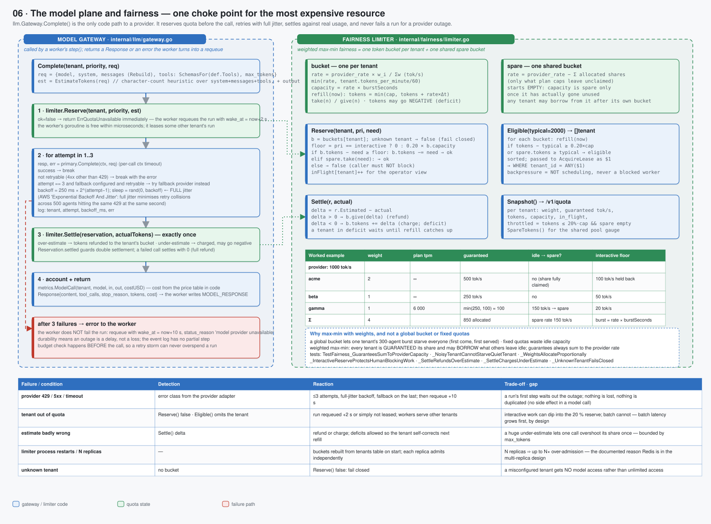

# 06 · The model plane and fairness — one choke point for the most expensive resource



> Spec: [`gen/d06_model_plane.py`](gen/d06_model_plane.py) · Code: [`backend/internal/llm/gateway.go`](../../backend/internal/llm/gateway.go), [`fairness/limiter.go`](../../backend/internal/fairness/limiter.go) · Reasoning: [fairness](../reasoning/07-fairness.md), [LLM integration](../reasoning/09-llm-integration.md) · Concept: [fairness](../01-concepts/06-fairness.md)

## What this shows

`llm.Gateway.Complete()` — the only code path to a model provider — as a
five-step pipeline (reserve, attempt ×3 with full-jitter backoff, settle,
account, or fail to the worker), and the fairness limiter's internals: one token
bucket per tenant, one shared spare bucket, `Reserve`/`Settle`/`Eligible`/
`Snapshot`, with a worked example and the failure table.

## Services

Both live **inside the worker process**. There is no separate "LLM proxy"
Deployment: the gateway is a package that every worker calls, and the limiter is
its state. That is why the limiter is per-process (see gaps).

| Component | Responsibility |
|---|---|
| `llm.Gateway` | reserve quota → call provider (retries, fallback) → settle → account |
| `llm.Provider` | the adapter interface; the PoC ships a scripted `FakeProvider` with configurable latency, jitter and failure injection |
| `fairness.Limiter` | weighted max-min buckets; `Reserve`, `Settle`, `Eligible`, `Snapshot` |
| price table | `$/Mtok` in and out per model, in code, used for `cost_usd` |

## Domain boundaries

**Quota is decided before the call, by the tenant's share, not after by a
bill.** `Reserve(tenant, priority, est)` either grants the estimate or returns
`false`; a `false` must never block the caller — the worker parks the run with
`wake_at = now + 2 s` and leases someone else's work.

**Nothing in the model plane can fail a run.** A provider outage after three
attempts is an error to the worker, which re-queues with `wake_at = now + 10 s`
and `status_reason = "model provider unavailable"`. The event log has no
partial step; durability means an outage is a delay.

**Budgets are checked before the call, at the worker** (`Budget.ExceedsReason`),
and again at the gateway for tool calls. A retry storm can therefore never
overspend a run: the check happens before each attempt sequence, not after.

## Data flow

```
Complete(tenant, priority, req):
  est := EstimateTokens(req)                         // character-count heuristic: system + messages + tool schemas, plus an output allowance
  r, ok := limiter.Reserve(tenant, priority, est)
  if !ok → ErrQuotaUnavailable                       // worker: requeue +2 s
  for attempt := 1..3:
     resp, err := primary.Complete(ctx, req)         // per-call timeout
     if err == nil → break
     if !retryable(err) → break
     if attempt == 3 && fallback != nil → try fallback
     backoff := 250 ms × 2^(attempt−1); sleep rand(0, backoff)   // FULL jitter
  limiter.Settle(r, resp.InputTokens + resp.OutputTokens)      // exactly once; failure settles 0
  metrics.ModelCall(tenant, model, in, out, cost)
  return resp | error                                // worker: requeue +10 s
```

### The limiter

```
share_i   = provider_rate × w_i / Σw,  capped at tenant.tokens_per_minute / 60
capacity  = share × burstSeconds
spare     = provider_rate − Σ shares   (only what plan caps leave unclaimed; starts empty)

Reserve(t, pri, need):
  floor = pri == interactive ? 0 : 0.20 × capacity      // the interactive reserve
  if tokens − need ≥ floor      → take from the tenant's bucket
  elif spare.take(need)         → borrow idle capacity
  else                          → false

Settle(r, actual):
  delta = est − actual;  delta > 0 → refund;  delta < 0 → charge (bucket may go negative)

Eligible(typical):  tenants whose bucket can afford `typical` above the floor, or spare can
                    → sorted list → AcquireLease … WHERE tenant_id = ANY($1)
```

Worked example (provider 1 000 tok/s): acme w=2 → 500 tok/s; beta w=1 → 250;
gamma w=1 but plan 6 000 tpm → `min(250, 100)` = 100; spare = 150 tok/s that
any tenant may borrow once its own bucket is drained. The interactive floor
holds back 20 % of each bucket for human-blocking work.

## Failure handling

| Failure / condition | Detection | Reaction | Trade-off · gap |
|---|---|---|---|
| provider 429 / 5xx / timeout | error class from the adapter | ≤ 3 attempts with full-jitter backoff; fallback provider on the last; then requeue +10 s | the run's step waits out the outage; nothing lost, nothing duplicated (a model call has no side effect) |
| tenant out of quota | `Reserve` false; `Eligible` omits the tenant | requeue +2 s or simply not leased; workers serve other tenants | interactive work may dip into the 20 % reserve, batch may not — batch latency grows first, by design |
| estimate badly wrong | `Settle` delta | refund or charge; deficits allowed so the tenant self-corrects on refill | one call can overshoot its share once; bounded by `max_tokens` |
| limiter restart / N replicas | — | buckets rebuilt from `tenants` on start; each replica admits independently | **gap**: N replicas ⇒ up to N× over-admission — the reason Redis is in the multi-replica design |
| unknown tenant | no bucket | `Reserve` false: fail closed | a misconfigured tenant gets *no* model access rather than unlimited |
| tenant set changes | `SetTenants` | every share recomputed; guarantees always sum to the provider rate | a new tenant reduces everyone's guarantee (correct: the provider rate did not grow) |

## Optimisations

* **Full jitter** (`sleep = rand(0, backoff)`) rather than fixed or equal
  jitter: 500 agents that all receive a 429 in the same second must not retry in
  the same second. This is the AWS Architecture Blog's recommendation and the
  measured best in their simulation.
* **Reserve-then-settle** instead of charge-after: a conservative estimator
  does not permanently shrink a tenant's throughput (over-estimates are
  refunded), and under-estimates are charged so the tenant cannot game the
  estimate.
* **Backpressure in the scheduler** — `Eligible()` is evaluated once per tick
  and pushed into SQL, so an out-of-quota tenant costs zero worker time.
* **Three attempts, not "until it works".** Unbounded retries against a
  degraded provider are how a platform turns a partial outage into a full one.
  Durability makes giving up cheap.

Evidence: `TestFairness_NoisyTenantCannotStarveQuietTenant`,
`_WeightsAllocateProportionally`, `_InteractiveReserveProtectsHumanBlockingWork`,
`_SettleRefundsOverEstimate`, `_SettleChargesUnderEstimate`,
`_UnknownTenantFailsClosed`, `_GuaranteesSumToProviderCapacity`;
[benchmarks §5](../04-evidence/01-benchmarks.md).

## Trade-offs

| Chosen | Instead of | Cost |
|---|---|---|
| weighted max-min with a spare pool | one global bucket (FCFS) · fixed per-tenant quotas | more state (a bucket per tenant); must recompute on membership change |
| in-process limiter | a central rate-limit service (Envoy ratelimit, Redis GCRA) | correct per replica only; N× over-admission across replicas until Redis-backed |
| estimate then settle | exact pre-metering (tokenise before sending) | an estimate can be wrong by 2×; settlement corrects it after one call |
| requeue on outage | fail the run / retry forever | latency instead of failure; a run may wait through a long outage with no operator signal except `runs{state=QUEUED}` |
| provider fallback on the last attempt only | immediate failover | two providers' worth of prompts only when the primary is degraded; keeps cost on the intended model |

## Where to look in the code

* [`llm/gateway.go`](../../backend/internal/llm/gateway.go) — `Complete`, `isRetryable`, backoff
* [`llm/fake.go`](../../backend/internal/llm/fake.go) — the scripted provider (`FailEvery`, scenarios including prompt injection)
* [`fairness/limiter.go`](../../backend/internal/fairness/limiter.go) — buckets, `SetTenants`, `Reserve`, `Settle`, `Eligible`, `Snapshot`
* [`runtime/worker.go`](../../backend/internal/runtime/worker.go) — the requeue paths (`ErrQuotaUnavailable`, provider unavailable)
* Tests: `fairness/limiter_test.go`, `TestLoad_BurstDoesNotStarveTheOtherTenant`
