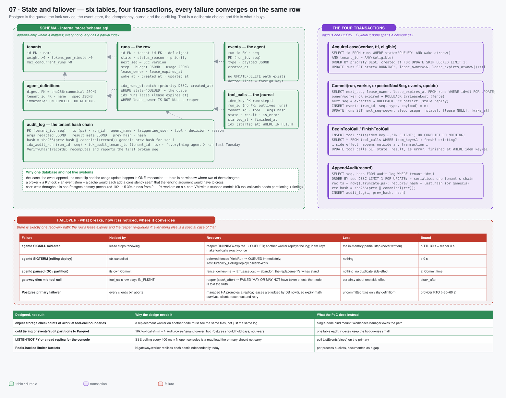

# 07 · State and failover — six tables, four transactions, one recovery path



> Spec: [`gen/d07_state_failover.py`](gen/d07_state_failover.py) · Code: [`backend/internal/store/schema.sql`](../../backend/internal/store/schema.sql), [`postgres.go`](../../backend/internal/store/postgres.go), [`verify.go`](../../backend/internal/store/verify.go) · Reasoning: [durability substrate](../reasoning/03-durability-substrate.md), [audit](../reasoning/08-audit.md) · Concept: [durable execution](../01-concepts/02-durable-execution.md), [data model](../02-architecture/02-data-model.md)

## What this shows

Postgres is the queue, the lock service, the event store, the idempotency
journal and the audit log. The diagram shows the six tables and their
relations, the four transactions that touch them, the failover table (what
breaks, how it is noticed, where it converges, what is lost, how long it
takes), and the four things that are designed but not built.

## Services

One StatefulSet in the PoC (`postgres`, :5432, ingress from exactly three
Deployments, egress none). Production replaces it with a managed HA Postgres;
nothing in the code assumes a single node except the workspace bind mount,
which is the object-storage gap.

## Domain boundaries: who writes what

| Table | Written by | Read by | Shape |
|---|---|---|---|
| `tenants` | seed / operator | API (admission), limiter (`SetTenants`) | small, static |
| `agent_definitions` | API (`POST /v1/agents`) | API, workers, gateway (by digest) | immutable, content-addressed |
| `runs` | API (create, human actions), workers (lease, commit), reaper | everyone | the mutable summary + lease + OCC version |
| `events` | workers (`Commit`), API (`AppendSystemEvents`) | workers (replay), API (SSE, history) | append-only; PK `(run_id, seq)` |
| `tool_calls` | gateway only | gateway (replay), reaper (stuck) | idempotency journal; PK `idem_key` |
| `audit_log` | gateway only | API (`/v1/audit`, `VerifyChain`) | per-tenant hash chain; PK `(tenant_id, seq)` |

The two boundaries worth stating: **the API never touches `tool_calls`**
(the journal belongs to the gateway), and **no code path updates or deletes an
event** — there is no `UPDATE events` anywhere.

## Data flow: the four transactions

```sql
-- 1. AcquireLease(worker, ttl, eligible)
SELECT id FROM runs WHERE state='QUEUED' AND (wake_at IS NULL OR wake_at<=now())
  AND (lease_expires_at IS NULL OR lease_expires_at<now())
  AND ($1::text[] IS NULL OR cardinality($1::text[])=0 OR tenant_id = ANY($1))
  ORDER BY priority DESC, created_at FOR UPDATE SKIP LOCKED LIMIT 1;
UPDATE runs SET state='RUNNING', lease_owner=$w, lease_expires_at=now()+ttl WHERE id=…;

-- 2. Commit(run, worker, expectedNextSeq, events, update)
SELECT next_seq, lease_owner, lease_expires_at FROM runs WHERE id=$1 FOR UPDATE;
--   owner≠worker OR expired → ROLLBACK ErrLeaseLost      (the fence)
--   next_seq≠expected       → ROLLBACK ErrConflict       (stale replay)
INSERT INTO events (run_id, seq, type, payload) VALUES (…) × n;
UPDATE runs SET next_seq=seq+n, step=…, usage=…, [state], [lease NULL], [wake_at];

-- 3. BeginToolCall / FinishToolCall
INSERT INTO tool_calls (idem_key, run_id, tenant_id, tool, args_hash, state)
  VALUES (…, 'IN_FLIGHT') ON CONFLICT (idem_key) DO NOTHING;
SELECT * FROM tool_calls WHERE idem_key=$1;                  -- fresh? or existing (replay)?
-- … the side effect happens outside any transaction …
UPDATE tool_calls SET state=$2, result=$3, is_error=$4, finished_at=now() WHERE idem_key=$1;

-- 4. AppendAudit(record)
SELECT seq, hash FROM audit_log WHERE tenant_id=$1 ORDER BY seq DESC LIMIT 1 FOR UPDATE;
-- rec.ts = now() truncated to µs; rec.prev_hash = last.hash (or genesis)
-- rec.hash = sha256(prev_hash ‖ canonical(rec))
INSERT INTO audit_log (…, prev_hash, hash) VALUES (…);
```

Each is one `BEGIN … COMMIT`, and **none spans a network call**: the side
effect in (3) is deliberately outside the transaction, which is exactly why the
journal has an `IN_FLIGHT` state and the reaper has a stuck-call clause.

### Indexes and why

| Index | Serves |
|---|---|
| `idx_runs_dispatch (priority DESC, created_at) WHERE state='QUEUED'` | the lease query; partial so terminal history never bloats it |
| `idx_runs_lease (lease_expires_at) WHERE lease_owner IS NOT NULL` | the reaper |
| `idx_runs_tenant_state (tenant_id, state)` | admission control, the overview |
| `events PK (run_id, seq)` | replay and SSE `since` scans, no sort |
| `idx_toolcalls_inflight (started_at) WHERE state='IN_FLIGHT'` | the stuck-call reaper |
| `idx_audit_tenant_ts (tenant_id, ts)` | "every command agent X ran last Tuesday" |

## Failure handling

| Failure | Noticed by | Recovery | Lost | Bound |
|---|---|---|---|---|
| agentd SIGKILL mid-step | lease stops renewing | reaper → QUEUED; another worker replays; idem keys make tool calls exactly-once | the in-memory partial step (never written) | ≤ TTL 30 s + reaper 5 s |
| agentd SIGTERM (rolling deploy) | context cancelled | deferred fenced `YieldRun` → QUEUED at once | nothing | ≈ 0 |
| agentd paused (GC / partition) | its own `Commit` | fence: `owner ≠ me` → `ErrLeaseLost`; the replacement's writes stand | nothing; no duplicate side effect | at commit |
| gateway dies mid tool call | `tool_calls` row stays `IN_FLIGHT` | reaper (`stuck_after`) → FAILED "MAY OR MAY NOT have taken effect" | certainty about one side effect | `stuck_after` |
| Postgres primary failover | every client's transaction aborts | managed HA promotes a replica; leases are judged by the DB's `now()` so expiry math survives; clients reconnect and retry | uncommitted transactions only | provider RTO (~30–60 s) |
| audit chain edited | `VerifyChain` | reports the first broken `seq` | — | on demand |
| disk full | write errors everywhere | nothing accepts work; nothing is lost | availability | until space |

"There is exactly one recovery path: the row's lease expires and the reaper
re-queues it; everything else is a special case of that."

## Optimisations

* **One transaction per transition.** The lease, the event append, the state
  flip and the usage update commit together. There is no window in which two
  of them disagree, and no second system whose failure could split them.
* **`next_seq` doubles as the OCC version**, so the fence needs no extra column
  and no extra round trip.
* **Partial indexes** keep the hot queries proportional to *live* work, not to
  history.
* **The chain head lock** serialises one tenant's audit writes and nothing
  else's; tenants do not contend with each other.
* **µs timestamps.** Hashing nanoseconds that Postgres stores as microseconds
  breaks every chain on read-back (B5); truncating before hashing and storing
  makes the stored record and the hashed record identical.

## Trade-offs

| Chosen | Instead of | Cost |
|---|---|---|
| Postgres for queue + lock + log + journal + audit | Kafka/SQS + Redis/etcd + an event store + a ledger | one primary's write throughput (measured: 102 → 5 394 runs/s from 2 → 24 workers on a 4-core VM with a stubbed model); 10 k tool calls/min needs partitioning and tiering |
| replay from the log | snapshots per step | O(events) read per step; checkpoint events are designed |
| hash chain per tenant | a Merkle tree / external transparency log | proves tampering but not omission by the DB owner; production adds periodic anchoring of the head hash to an external log |
| single-node workspace bind mount | object-storage checkpoints | a replacement worker on *another node* would not see the files — the largest designed-not-built gap |
| SSE polling on the primary | LISTEN/NOTIFY or a read replica | read load proportional to open consoles |

### Designed, not built

| Item | Why the design needs it | What the PoC does |
|---|---|---|
| object-storage checkpoints of `/work` at tool-call boundaries | replacement workers on other nodes need the same files, not just the same log | single-node bind mount |
| cold tiering of `events`/`audit_log` partitions to Parquet | 10 k tool calls/min ≈ 4 audit rows/s/tenant forever; hot Postgres should hold days, not years | one table each; partial indexes |
| LISTEN/NOTIFY or a read replica for the console | SSE polling × N consoles is read load the primary should not carry | poll `ListEvents(since)` |
| Redis-backed limiter buckets | N replicas admit independently today | per-process buckets |

## Where to look in the code

* [`schema.sql`](../../backend/internal/store/schema.sql) — the six tables and every index with a comment
* [`postgres.go`](../../backend/internal/store/postgres.go) — the four transactions, `ReapExpiredLeases`, `ReapStuckToolCalls`, `AppendAudit`
* [`verify.go`](../../backend/internal/store/verify.go) — `VerifyChain`
* [`memory.go`](../../backend/internal/store/memory.go) + [`conformance_test.go`](../../backend/internal/store/conformance_test.go) — the same suite runs against both stores (it caught B4 and B5)
* [`testsupport/`](../../backend/internal/testsupport/) — per-package schema isolation (B8)
