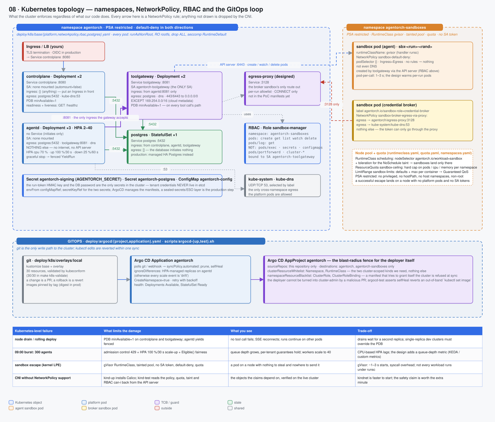

# 08 · Kubernetes topology — namespaces, NetworkPolicy, RBAC and the GitOps loop

> Spec: [`gen/d08_network_topology.py`](gen/d08_network_topology.py) · Manifests: [`deploy/k8s/base/`](../../deploy/k8s/base/), [`deploy/argocd/`](../../deploy/argocd/), [`scripts/`](../../scripts/) · Reasoning: [Kubernetes](../reasoning/11-kubernetes.md) · Concept: [Kubernetes](../01-concepts/09-kubernetes.md) · Ops: [deployment](../03-operations/02-deployment.md)

## What this shows

What the cluster enforces **regardless of what our code does**. Every arrow in
the two namespace zones is a NetworkPolicy rule; anything not drawn is dropped
by the CNI. Below it, the GitOps loop that makes git the only write path to
the cluster, and the AppProject that fences the deployer itself.

## Services (cluster objects)

| Object | Kind | Notes |
|---|---|---|
| `agentorch` | Namespace | Pod Security Admission `restricted`; `platform-default-deny` |
| `agentorch-sandboxes` | Namespace | PSA `restricted`; `sandbox-default-deny` (ingress + egress, no rules); ResourceQuota + LimitRange |
| `controlplane` | Deployment ×2 + Service :8080 + PDB | no ServiceAccount token; ingress `{}`; egress postgres + dns |
| `toolgateway` | Deployment ×2 + Service :8081 + PDB | the **only** SA (`agentorch-toolgateway`); ingress from agentd only; egress postgres, dns, 443/6443 except `169.254.0.0/16` |
| `agentd` | Deployment ×3 + HPA 2–40 | no SA token; no Service; egress postgres + toolgateway + dns, nothing else |
| `postgres` | StatefulSet ×1 + Service :5432 | ingress from the three above; `egress: []` |
| `agentorch-sandbox-manager` | Role + RoleBinding in `agentorch-sandboxes` | `pods` create/get/list/watch/delete, `pods/log` get — **not** exec, secrets, portforward |
| `gvisor` | RuntimeClass (`handler: runsc`) | scheduling: nodeSelector `agentorch.io/workload=sandbox` + toleration for its `NoSchedule` taint |
| `sandbox-ceiling`, `sandbox-limits` | ResourceQuota, LimitRange | hard caps; defaults → Guaranteed QoS |
| `agentorch-signing`, `agentorch-postgres`, `agentorch-config` | Secret, Secret, ConfigMap | the run-token HMAC key and the DB password are the only secrets in etcd |
| `egress-proxy` | (designed) Deployment + Service :3128 | the broker sandbox's only route out |
| `agentorch` | Argo CD Application + AppProject | automated sync, prune, selfHeal; fenced project |

Every pod: `runAsNonRoot`, read-only root filesystem, `capabilities.drop: [ALL]`,
`seccompProfile: RuntimeDefault`, `automountServiceAccountToken: false` except
the gateway.

## Domain boundaries

**Two namespaces, two blast radii.** Platform pods and sandbox pods never share
a namespace, a node pool or a ServiceAccount. A sandbox escape lands on a
tainted node with no platform pods, no SA token, and a default-deny policy —
"a pod on a node with nothing to steal and nowhere to send it".

**Egress is a per-Deployment allowlist.** The claim "a worker cannot call a
third party directly" is not a promise our code makes; it is
`agentd-egress`, which permits `postgres:5432`, `toolgateway:8081` and
`kube-dns:53` and nothing else. The gateway is the only Deployment with egress
to `0.0.0.0/0`, and even that excludes the cloud metadata range.

**Kubernetes privilege is one Role.** Creating sandbox pods needs `pods`
create/get/list/watch/delete in one namespace. `pods/exec` (a shell in any
sandbox), `secrets` (credentials come from the broker, never etcd) and
`pods/portforward` (a tunnel into a sandbox) are deliberately absent.

**The deployer is fenced too.** The AppProject's `sourceRepos`, `destinations`,
`clusterResourceWhitelist` (Namespace, RuntimeClass only) and
`namespaceResourceBlacklist` (ClusterRole, ClusterRoleBinding) mean a malicious
PR cannot turn Argo CD into cluster-admin. `scripts/argocd-test.sh` asserts the AppProject exists and that `selfHeal` reverts an out-of-band `kubectl set image` within one sync.

## Data flow

Allowed connections, and the rule that allows each:

| From → to | Port | Rule |
|---|---|---|
| Ingress → controlplane | 8080 | `controlplane-policy` ingress `{}` (put an Ingress/gateway in front in production) |
| controlplane → postgres | 5432 | `controlplane-policy` egress; `postgres-ingress` |
| agentd → postgres | 5432 | `agentd-egress`; `postgres-ingress` |
| agentd → toolgateway | 8081 | `agentd-egress`; `toolgateway-policy` ingress (from agentd only) |
| toolgateway → postgres | 5432 | `toolgateway-policy`; `postgres-ingress` |
| toolgateway → API server / third parties | 443, 6443 | `toolgateway-policy` egress to `0.0.0.0/0` except `169.254.0.0/16` |
| toolgateway → sandbox pods | — | not a network flow: pods are created via the API server (RBAC) |
| broker sandbox → egress-proxy | 3128 | `sandbox-broker-egress-via-proxy` (label `agentorch.io/sandbox-role=credential-broker`) |
| broker sandbox → kube-dns | 53 | same policy |
| agent sandbox → anything | — | **nothing**: `sandbox-default-deny` has no rules, not even DNS |
| any platform pod → kube-dns | 53 | each policy's dns clause; the only cross-namespace egress |

## Failure handling

| Kubernetes-level failure | What limits the damage | What you see | Trade-off |
|---|---|---|---|
| node drain / rolling deploy | PDB `minAvailable: 1` on controlplane and toolgateway; agentd yields fenced | no tool call fails; SSE reconnects; runs continue on other pods | drains wait for a second replica; single-replica dev clusters must override the PDB |
| 09:00 burst of 300 agents | admission control 429 + HPA scale-up 100 %/30 s + `Eligible()` fairness | queue depth grows, per-tenant guarantees hold, workers scale to 40 | CPU-based HPA lags a queue; the design adds a queue-depth metric (KEDA / custom metrics) |
| sandbox escape (kernel LPE) | gVisor, tainted pool, no SA token, default-deny, quota | a pod on a node with nothing to steal and nowhere to send it | gVisor's 1–3 s starts and syscall overhead; not every workload runs under runsc |
| CNI without NetworkPolicy support (kind's default kindnet) | `kind-up.sh` installs Calico; `kind-test.sh` reads the policy objects, quota, taint and RBAC `can-i` answers back from the live API server | the objects the claims depend on, verified on the cluster — not a manifest that silently does nothing | +1 minute cluster start; an actual denied-connection probe is the next test to add |
| manifest drift / `kubectl edit` | Argo CD `selfHeal` + `prune` | reverted within one sync; extras deleted | a hot-fix must go through git (that is the point) |
| HPA fighting Argo over `replicas` | `ignoreDifferences` on the agentd Deployment's replica count | scale events are not "drift" | none |
| API server unreachable from the gateway | pod creation fails → 502 to the agent | tool calls fail loudly; runs are not lost | none |

## Optimisations

* **kustomize base + overlay**, validated by `kubeconform` (30/30) in `make k8s-validate` — schema errors are caught before a cluster sees them.
* **Aggressive scale-up, slow scale-down** on the HPA (100 %/30 s up, 25 %/60 s
  down with a 300 s window) because bursts are the norm and thrashing is
  expensive.
* **One image for every Deployment** — the same digest is pinned everywhere;
  a rollback is one line.

## Trade-offs

| Chosen | Instead of | Cost |
|---|---|---|
| NetworkPolicy as the enforcement of "cannot reach" | trusting the application's own egress code | requires a CNI that implements it (Calico on kind); a CNI that ignores policy gives *false* assurance — `kind-up.sh` installs Calico for exactly that reason |
| gVisor RuntimeClass | Kata Containers / Firecracker | weaker than a microVM boundary, but runs on standard node pools without nested virtualisation |
| pod per tool call for the k8s driver | warm per-run pods | 1–3 s latency per call; the design warms pods for interactive agents |
| Argo CD with `selfHeal` | Flux / plain `kubectl apply` in CI | one more controller to run; in exchange drift is impossible to keep |
| a single tainted node pool for all tenants' sandboxes | a pool per tenant | cheaper; isolation between tenants' sandboxes rests on gVisor + NetworkPolicy, not on physical separation |

## Where to look

* [`deploy/k8s/base/networkpolicy.yaml`](../../deploy/k8s/base/networkpolicy.yaml) — every rule above with a comment
* [`deploy/k8s/base/platform.yaml`](../../deploy/k8s/base/platform.yaml) — Deployments, Services, HPA, PDBs, securityContexts
* [`deploy/k8s/base/rbac.yaml`](../../deploy/k8s/base/rbac.yaml), [`runtimeclass.yaml`](../../deploy/k8s/base/runtimeclass.yaml), [`quota.yaml`](../../deploy/k8s/base/quota.yaml), [`namespaces.yaml`](../../deploy/k8s/base/namespaces.yaml)
* [`deploy/argocd/project.yaml`](../../deploy/argocd/project.yaml), [`application.yaml`](../../deploy/argocd/application.yaml)
* [`scripts/kind-up.sh`](../../scripts/kind-up.sh), [`kind-test.sh`](../../scripts/kind-test.sh), [`argocd-up.sh`](../../scripts/argocd-up.sh), [`argocd-test.sh`](../../scripts/argocd-test.sh)
