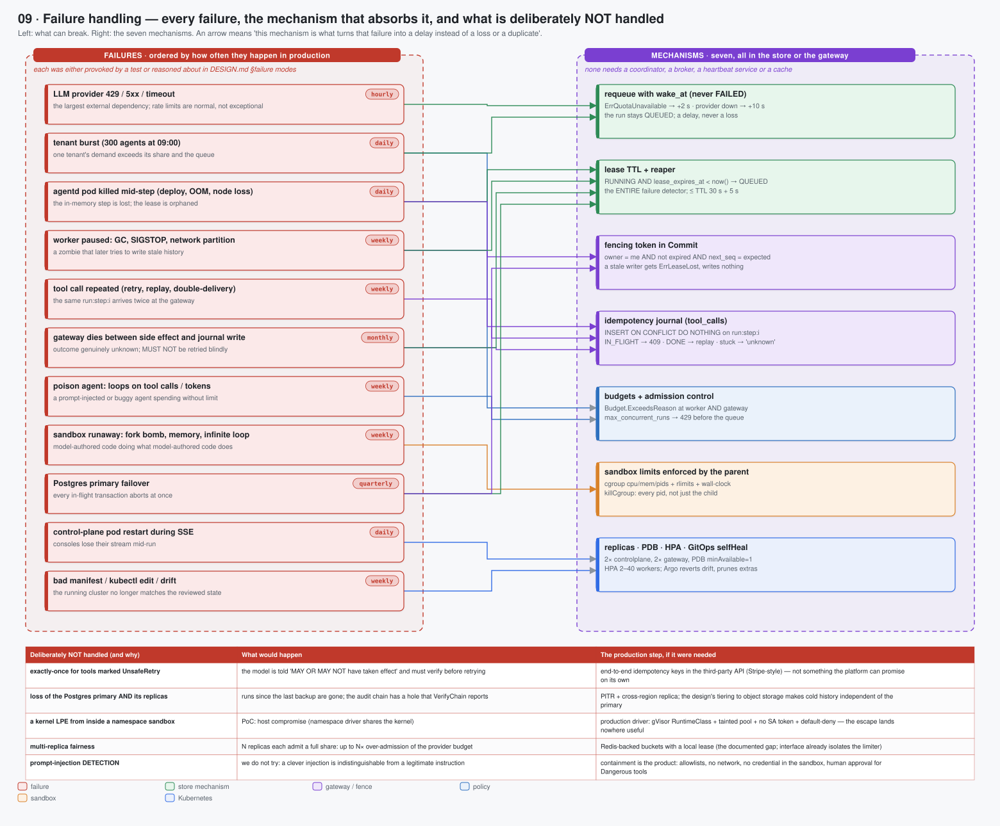

# 09 · Failure handling — every failure, the mechanism that absorbs it, and what is not handled

> Spec: [`gen/d09_failure_map.py`](gen/d09_failure_map.py) · Reasoning: [durability substrate](../reasoning/03-durability-substrate.md), [industry learnings](../reasoning/14-industry-learnings.md) · Design: [DESIGN.md §6](../../DESIGN.md) · Ops: [runbook](../03-operations/04-runbook.md)

## What this shows

Eleven failures on the left, ordered by how often they happen in production;
seven mechanisms on the right; an arrow means "this mechanism is what turns
that failure into a delay instead of a loss or a duplicate". Underneath, the
five things that are deliberately **not** handled, what would happen, and the
production step if it were ever needed.

The shape of the drawing is the argument: eleven failures map onto seven
mechanisms, and the seven all live in the store or the gateway. There is no
coordinator, no broker, no heartbeat service and no cache whose own failure
would need a further row.

## The seven mechanisms

| # | Mechanism | Where | Absorbs |
|---|---|---|---|
| 1 | **requeue with `wake_at`, never FAILED** | worker → `runs.wake_at` | provider outages and quota waits: `ErrQuotaUnavailable` → +2 s; provider down after retries → +10 s |
| 2 | **lease TTL + reaper** | `runs.lease_*`; `ReapExpiredLeases` every 3 s (wired in `serve.go`; the package default is 5 s) | any worker death or stall: `RUNNING AND lease_expires_at < now()` → `QUEUED`; bound ≤ TTL 30 s + 3 s |
| 3 | **fencing token in `Commit`** | `runs.lease_owner`, `next_seq` | a paused/partitioned worker that wakes later: `owner ≠ me` → `ErrLeaseLost`, nothing written |
| 4 | **idempotency journal** | `tool_calls`, PK `idem_key = run:step:i` | duplicate deliveries, replays after a worker swap, gateway crashes mid-call (`IN_FLIGHT` → "outcome unknown") |
| 5 | **budgets + admission control** | worker (`ExceedsReason`), gateway (`budget.exhausted`), API (`max_concurrent_runs` → 429) | poison agents and tenant bursts |
| 6 | **sandbox limits enforced by the parent** | cgroups, rlimits, wall-clock, `killCgroup` | fork bombs, memory bombs, infinite loops, output floods |
| 7 | **replicas · PDB · HPA · GitOps selfHeal** | Kubernetes | pod restarts, node drains, bursts, drift |

## The eleven failures

| Failure | Frequency | Mechanisms | What the operator sees |
|---|---|---|---|
| LLM provider 429 / 5xx / timeout | hourly | 1 | `runs{state=QUEUED}` with `status_reason` "model provider unavailable"; `model_calls_total` errors; logs with `attempt`, `backoff_ms` |
| tenant burst (300 agents at 09:00) | daily | 5, 1 | 429s in the API log; `quota_denied_total`; HPA scaling |
| agentd killed mid-step | daily | 2, 4 | `leases_reaped_total` +1; a `NOTE`/`LEASE_LOST` in the run's log; the run continues on another pod |
| worker paused (GC, SIGSTOP, partition) | weekly | 3, 2 | "lease lost mid-step; another worker has taken over" in the old worker's log — and nothing else, because nothing was written |
| tool call repeated | weekly | 4 | `Replayed=true` in the gateway response; no second audit `pre` record |
| gateway dies between side effect and journal write | monthly | 4, 2 | after `stuck_after`: the call is FAILED "MAY OR MAY NOT have taken effect"; the model sees it and must verify |
| poison agent looping | weekly | 5 | run FAILED with "budget exhausted (…)"; gateway denials with rule `budget.exhausted` |
| sandbox runaway | weekly | 6 | `Result.OOMKilled` / `TimedOut` / `Truncated` reported to the model; `sandbox_runs_total` |
| Postgres primary failover | quarterly | 2, 3 | a burst of store errors, then leases expiring on the DB clock and the reaper re-queueing |
| control-plane pod restart during SSE | daily | 7 | the console reconnects with `since = last seq`; no gap, no duplicate |
| bad manifest / `kubectl edit` / drift | weekly | 7 | Argo CD reverts within one sync; the diff is in the Argo UI |

## Deliberately not handled

| Not handled (and why) | What would happen | The production step, if it were needed |
|---|---|---|
| exactly-once for tools marked `UnsafeRetry` | the model is told "MAY OR MAY NOT have taken effect" and must verify before retrying | end-to-end idempotency keys in the third-party API (Stripe-style) — not something the platform can promise on its own |
| loss of the Postgres primary **and** its replicas | runs since the last backup are gone; the audit chain has a hole that `VerifyChain` reports | PITR + cross-region replica; the design's tiering to object storage makes cold history independent of the primary |
| a kernel LPE from inside a *namespace* sandbox | PoC: host compromise (shared kernel) | production driver: gVisor + tainted pool + no SA token + default-deny — the escape lands nowhere useful |
| multi-replica fairness | N replicas each admit a full share: up to N× over-admission of the provider budget | Redis-backed buckets with a local lease; the limiter interface already isolates it |
| prompt-injection **detection** | not attempted: a clever injection is indistinguishable from a legitimate instruction | containment is the product — allowlists, no network, no credential in the sandbox, human approval for `Dangerous` tools |

## How to use this page in an incident

1. Find the symptom in the "what the operator sees" column.
2. The mechanism column tells you which invariant is supposed to be holding.
3. If the invariant is *not* holding — a run RUNNING with a dead owner for
   longer than TTL + 3 s, a `tool_calls` row IN_FLIGHT beyond `stuck_after`,
   two audit `pre` records for one idempotency key — that is a platform bug,
   not an operational condition, and the [runbook](../03-operations/04-runbook.md)
   has the queries.

## Trade-offs

* **Time-to-recover is bounded by the lease TTL**, not by a heartbeat
  interval. A shorter TTL recovers faster but risks fencing out a merely slow
  worker; 30 s with a 10 s heartbeat is the chosen point.
* **"Outcome unknown" is a feature.** Telling the model that a side effect may
  have happened costs it a verification step; hiding that would cost a
  duplicate charge, PR or email.
* **Some failures are made loud on purpose.** A sandbox setup failure is a 502
  from the platform, not a shell error blamed on the agent, so a bug in our
  jail is never misread as a bug in the tenant's prompt.

## Where the evidence is

* Durability: `TestDurability_WorkerKilledMidToolCall_RunCompletesExactlyOnce`,
  `_RollingDeployLosesNoWork`, `_PartitionedWorkerIsFencedOut`
  ([benchmarks §6](../04-evidence/01-benchmarks.md))
* Store: `TestLease_OnlyOneWorkerWins`, `TestCommit_RejectedAfterLeaseLost`,
  `TestToolCall_StuckCallsAreReapedAsAmbiguous`
* Sandbox: S7–S10 in [safety proofs](../04-evidence/02-safety-proofs.md)
* The bug that motivated mechanism 2's second clause: [B6](../04-evidence/03-bugs-found.md)
