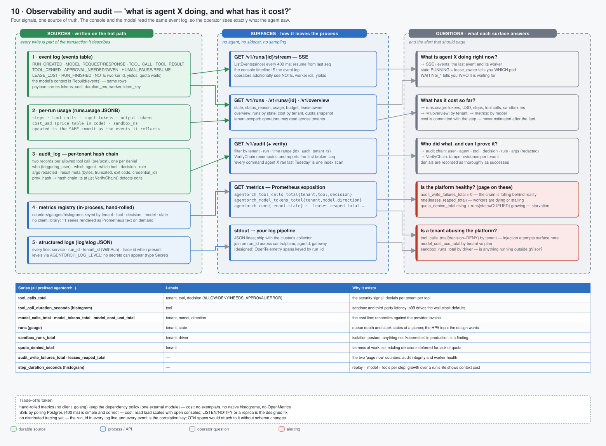

# 10 · Observability and audit — "what is agent X doing, and what has it cost?"



> Spec: [`gen/d10_observability.py`](gen/d10_observability.py) · Code: [`backend/internal/obs/`](../../backend/internal/obs/), [`store/verify.go`](../../backend/internal/store/verify.go) · Reasoning: [audit](../reasoning/08-audit.md) · Ops: [observability](../03-operations/03-observability.md)

## What this shows

Five sources written on the hot path, five surfaces that expose them, and the
five questions an operator asks — with the alert that should page for each.
The design principle is one source of truth: the console timeline is rebuilt
from the same `events` rows the model's context is rebuilt from, so the
operator sees exactly what the agent saw. There is no parallel telemetry
pipeline that can drift from reality.

## Services

None dedicated. Every signal is produced by the process doing the work:

| Source | Written by | In the same transaction as… |
|---|---|---|
| `events` | workers, API | the step it describes (`Commit`) |
| `runs.usage` | workers | the same `Commit` |
| `audit_log` | gateway | its own transaction, before (`pre`) and after (`post`) the side effect |
| metrics registry | every process, in memory | — (rendered on `GET /metrics`) |
| structured logs | every process, `log/slog` JSON to stdout | — |

## Domain boundaries

* **The event log is the operator's view and the model's view.** Projections
  differ (operators see `NOTE`, quota waits and worker ids; the model does not),
  but they come from one table, so they cannot disagree about what happened.
* **Cost is committed, not estimated.** `runs.usage` (steps, tool calls, tokens,
  USD from the price table, sandbox ms) is updated in the same transaction as
  the events it reflects. `/v1/overview` aggregates it; nothing is reconciled
  after the fact.
* **The audit chain is the security record**, separate from the event log:
  it is per tenant, hash-chained, written by the gateway only, and carries the
  *decision* (rule, reason, args hash) as well as the outcome.
* **No secrets can appear anywhere here** — the `Secret` type redacts in every
  formatter; audit meta carries `credential_id`, never the value.

## Data flow: the five questions

| Question | Surface | Answer |
|---|---|---|
| What is agent X doing right now? | SSE / `GET /v1/runs/{id}/events` | the last event and its worker; `state=RUNNING` + `lease_owner` says which pod; `WAITING_*` says who it is waiting for |
| What has it cost so far? | `runs.usage`, `/v1/overview`, metrics | tokens, USD, steps, tool calls, sandbox ms — per run, per tenant, per model |
| Who did what, and can I prove it? | `GET /v1/audit` + `VerifyChain` | user · agent · tool · decision · rule · args (redacted); tamper-evidence per tenant |
| Is the platform healthy? | `GET /metrics` | `audit_write_failures_total > 0` (page), `rate(leases_reaped_total)` (workers dying), `quota_denied_total` + `runs{state=QUEUED}` growing (starvation) |
| Is a tenant abusing the platform? | metrics, audit | `tool_calls_total{decision=DENY}` by tenant (injection attempts surface here), `model_cost_usd_total` vs plan, `sandbox_runs_total{driver}` (anything not gVisor in production is a finding) |

### The eleven metric series

| Series (`agentorch_…`) | Labels | Why |
|---|---|---|
| `tool_calls_total` | tenant, tool, decision | the security signal |
| `tool_call_duration_seconds` | tool | sandbox and third-party latency; p99 drives timeout defaults |
| `model_calls_total`, `model_tokens_total`, `model_cost_usd_total` | tenant, model, direction | the cost line; reconciles against the provider invoice |
| `runs` (gauge) | tenant, state | queue depth and stuck states; the HPA input the design wants |
| `sandbox_runs_total` | tenant, driver | isolation posture |
| `quota_denied_total` | tenant | fairness at work |
| `audit_write_failures_total`, `leases_reaped_total` | — | the two "page now" counters |
| `step_duration_seconds` | — | replay + model + tools per step; growth over a run's life shows context cost |

### The audit chain

```
record  = {tenant, seq, ts(µs), run, agent, user, tool, decision, reason, args_redacted, result_meta}
hash    = sha256(prev_hash ‖ canonical_json(record))
verify  = recompute from seq 1; report the first seq whose prev_hash ≠ previous hash
```

Two records per allowed call (`pre` = intent, `post` = outcome) and one per
denial. Editing, deleting or reordering any record breaks every hash after it.

## Failure handling

| Failure | Effect | Signal |
|---|---|---|
| audit write fails | the call proceeds (PoC); the design refuses the call | `audit_write_failures_total` — page on `> 0` |
| SSE consumer falls behind | it resumes from `since`; nothing is buffered per client | none needed |
| metrics registry restarts | counters reset (in-process) | Prometheus handles resets |
| log pipeline down | stdout still has everything; nothing in the platform depends on logs | none |
| chain verification fails | `VerifyChain` names the seq | an incident, not an alert rule |

## Optimisations

* **No client libraries.** Metrics are ~150 lines rendering Prometheus text on
  demand; logging is `log/slog`. The whole binary has one external module.
* **`run_id` on everything.** Every log line, every event, every audit record
  and every metric label that can carry it does; that is the correlation key
  for OpenTelemetry spans when they are added.
* **Read models on indexes, not tables.** `idx_audit_tenant_ts` makes "every
  command agent X ran last Tuesday" one range scan.

## Trade-offs

| Chosen | Instead of | Cost |
|---|---|---|
| hand-rolled metrics | `client_golang` | no exemplars, no native histograms, no OpenMetrics |
| SSE by polling Postgres (400 ms) | LISTEN/NOTIFY, websockets, a stream | read load ∝ open consoles; designed fix: NOTIFY or a replica |
| no distributed tracing yet | OTel from day one | cross-process latency must be joined by `run_id` in logs; spans attach later without schema changes |
| audit on the gateway only | audit every API call too | human actions are in the event log, not the chain; production adds them to the chain |
| in-process counters | a metrics sidecar / agent | counters reset on restart; the rate functions are unaffected |

## Where to look in the code

* [`obs/metrics.go`](../../backend/internal/obs/metrics.go) — the registry and the exposition renderer
* [`obs/log.go`](../../backend/internal/obs/log.go) — `NewLogger(service)`, `WithRun`, trace ids
* [`api/api.go`](../../backend/internal/api/api.go) — `streamRun`, `overview`, `listAudit`
* [`store/postgres.go`](../../backend/internal/store/postgres.go) — `AppendAudit`; [`verify.go`](../../backend/internal/store/verify.go) — `VerifyChain`
* [`ui/src/components/`](../../ui/src/components/) — Overview, Runs, RunDetail (SSE), Audit, Quota
