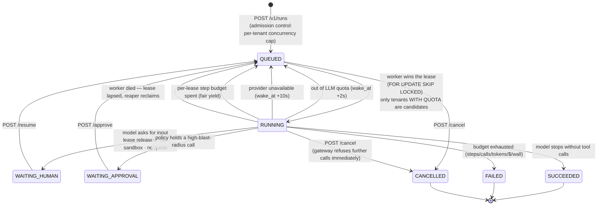
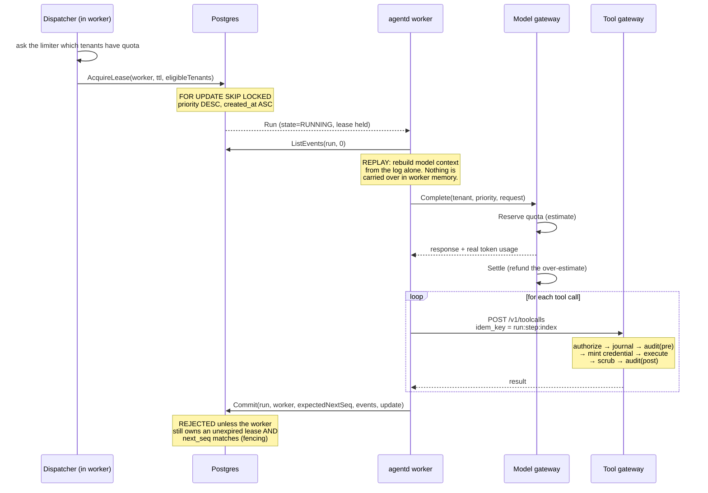

# Agent lifecycle

## What a single agent IS at runtime

**A row in `runs` plus an append-only `events` log.** Not a pod. Not a process.
Not a goroutine. A worker borrows it for one step and gives it back.

## Why the idle states cost nothing

`WAITING_HUMAN` is the state the brief's "waits days for a human reply" lands in.
In it the run holds:

| Resource | Held? |
|---|---|
| Worker / goroutine / pod | **No** — `ReleaseLease` clears the owner |
| Sandbox | **No** — destroyed at the end of the tool call |
| LLM quota reservation | **No** — settled before the step ended |
| Database connection | **No** |
| **A row and its event log** | Yes — a few KB |

A two-day wait therefore costs storage and nothing else. That is the entire
argument for *not* running one long-lived process per agent.

## One step, in detail

The two guards on `Commit` are what make failover safe:

- **Lease fence** — a worker that was partitioned and has since been replaced
  cannot write. Its commit returns `ErrLeaseLost` and it abandons the step.
  (Kleppmann, *How to do distributed locking*.)
- **Sequence check** — optimistic concurrency on `next_seq` catches any
  interleaving the lease check alone would miss.

## Failover, precisely

A worker is SIGKILLed mid-tool-call:

1. Nothing is flushed. The lease is **not** released.
2. Up to `LeaseTTL` (30s default) later, the reaper's `UPDATE ... WHERE lease_expires_at < now()` moves the run back to `QUEUED`.
3. Another worker leases it and **replays the event log**, reaching the same
   tool call at the same step index.
4. It sends the **same deterministic idempotency key**, `run:step:index`.
5. The gateway finds the key in its journal and returns the recorded result
   **without re-executing the side effect**.

If the gateway itself died mid-call, the journal entry is still `IN_FLIGHT`.
The replaying worker gets `409`, and the reaper eventually marks it `FAILED`
with a message that says, verbatim, that the call *may or may not* have taken
effect. That is the honest answer — see "Failure modes" in DESIGN.md.
