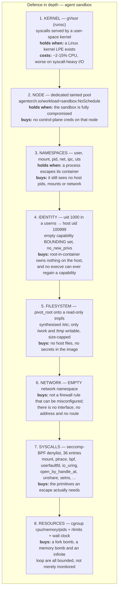
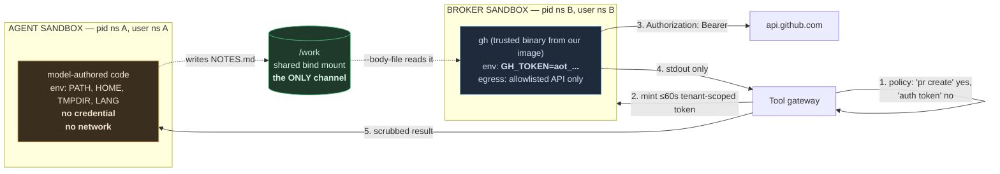

# Sandbox design

## The layers, and what each one buys

Every layer will eventually have a CVE. The question is not "is this layer
sound" but "what still holds when this layer fails".

## How `gh` gets a token the agent cannot read

This is the question the brief asks directly. The answer is that **`gh` does not
run in the agent's sandbox at all**.

Because they are different processes in **different pid and user namespaces**,
the agent cannot:

- read `/proc/<pid>/environ` of the broker — that pid is not in its namespace
- `ptrace` it — blocked by seccomp *and* by the namespace
- see it in `ps` — different pid namespace
- receive the token in any response — the gateway scrubs the value from output
  as a last resort, after policy has already blocked the commands that would
  print it

**Verified by test.** `make demo` runs an agent whose script does
`env | sort`, `cat /proc/self/environ` and `env | grep -iE 'token|secret|key'`,
asserts the output contains `NO CREDENTIALS IN ENVIRONMENT`, and *then* asserts
that `gh pr create` succeeded and that the fake GitHub API **verified a real,
freshly minted, correctly scoped token**. Both must hold.

## Measured cold start

| Driver | Mean cold start | Measured how |
|---|---|---|
| `namespace` (this host) | **8.4 ms** (worst 19.4 ms over 10 runs) | `TestSandbox_ColdStartIsMeasured` |
| `docker` | ~150–400 ms | daemon round trip dominates |
| `kubernetes` + gVisor | ~1–3 s | scheduling + sandbox creation |

This number decides the sandbox lifecycle policy. At 8 ms, **per-call ephemeral
sandboxes** are affordable and give the strongest isolation. At 1–3 s they are
not, which is why the Kubernetes driver's design keeps a **warm per-run
sandbox** for interactive agents and falls back to per-call for batch ones.
The measurement drives the architecture, not the other way round.

## What happens when a sandbox is compromised

Assume it will be.

| | |
|---|---|
| **Blast radius** | One run, one tenant, one workspace. No network. No credential (or one that expires in ≤60s). |
| **Detection** | eBPF runtime rules (Falco/Tetragon) on the sandbox node pool; gVisor's own blocked-syscall log; egress-proxy denials; a rise in `agentorch_tool_calls_total{decision="DENY"}`. |
| **Containment** | The pod has no ServiceAccount token, runs on a tainted node with no control-plane credentials, and has a `ResourceQuota` ceiling above it. |
| **Response** | Kill the pod; cordon and drain the node with a snapshot for forensics; revoke every credential minted for that run; freeze the tenant's runs; replay the tenant's audit chain to establish exactly what ran. |
| **Why the credential barely matters** | Minted per call, ≤60s TTL, bound to one tenant and one credential reference, and explicitly revoked after use. A stolen one is near-worthless. |
