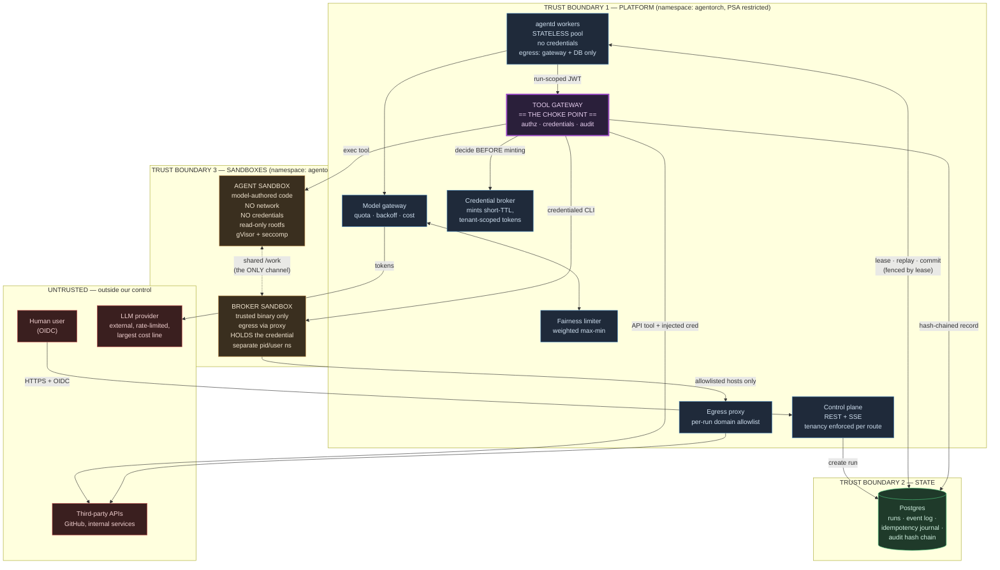

# System diagram and trust boundaries

## What crosses each boundary, and what cannot

| Boundary | Crosses inward | Crosses outward | Enforced by |
|---|---|---|---|
| User → Platform | OIDC identity, agent definition, run input | Run status, event log, audit records — **tenant-scoped on every route** | `api.mustRun` resolves the caller to a tenant; cross-tenant reads return **404, not 403**, so run ids cannot be probed |
| Worker → Gateway | Tool name + arguments + deterministic idempotency key + run-scoped JWT | Tool result (size-capped, credential-scrubbed) | HMAC JWT bound to `audience=tool-gateway`; NetworkPolicy `agentd-egress` permits the gateway and Postgres only |
| Gateway → Sandbox | argv, environment allowlist, workspace bind-mount | stdout/stderr (capped), exit code | Empty network namespace; read-only rootfs; cgroup + rlimit; seccomp |
| Agent sandbox ↔ Broker sandbox | **Nothing but files in `/work`** | **Nothing but files in `/work`** | Different pid + user namespaces: no `/proc/<pid>/environ`, no `ptrace` |
| Gateway → Third party | Request with an injected, freshly minted, ≤60s credential | Response body | Credential exists only in the gateway's memory or the broker sandbox's environment |

## The three things that never cross a boundary

1. **A credential never reaches the agent.** Not in the model context, not in the worker process, not in the agent's sandbox environment. The `creds.Secret` type redacts through `fmt`, `json.Marshal`, `%#v` and error wrapping; `grep -rn '.Reveal()'` enumerates every plaintext use site (**three**: output scrubbing, gateway-side header injection, and the broker sandbox's environment — asserted by a test).
2. **A tenant never reaches another tenant.** Every store query is tenant-scoped, workspaces are `<root>/<tenant>/<run>`, credential root secrets are per tenant, audit chains are per tenant, and sandbox host uids are per tenant.
3. **A sandbox never reaches the network.** Not a firewall rule that can be misconfigured — an empty network namespace with no interface, no address and no route.
