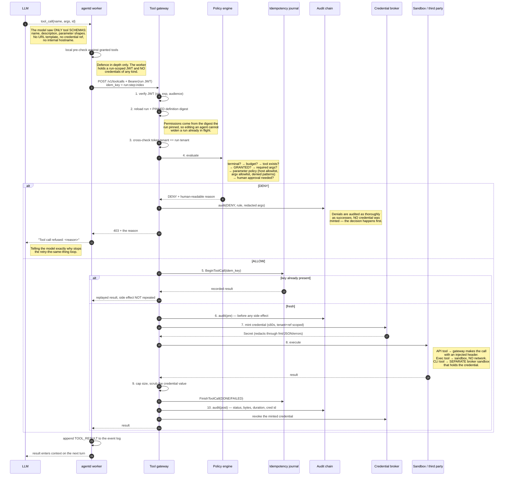
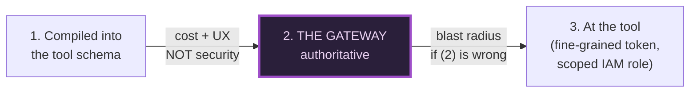

# The tool call path

Every tool call in the system goes through `gateway.process`. This is the
sequence, with the answer to "what can the agent see at each step" beside it.

## What the agent can and cannot see, per step

| Step | Agent sees | Agent does **not** see |
|---|---|---|
| Model request | Tool schemas for its **granted** tools only | Other tools, URL templates, credential refs, internal hostnames |
| Worker process | Tool args and results; a run-scoped JWT (≤5 min, audience-bound) | Any tenant credential — the worker has none to leak |
| Policy decision | The human-readable reason for a denial | The rule set, other tenants' policy, whether a credential exists |
| Exec sandbox | `/work`, the command, a fixed safe environment | The network, the host filesystem, any credential, other processes |
| Broker sandbox | — *(the agent has no handle on this process at all)* | n/a |
| Result | Output, capped and scrubbed | Credential values, response headers, gateway internals |

## Where authorization lives — and why in three places

1. **In the schema** — the model is only shown tools it may call. Saves tokens
   and avoids noise. **Not** security: a model can emit any name it likes, and
   an injected prompt actively will.
2. **At the gateway** — the enforcement point, because it is the only place
   that sees every call, cannot be bypassed (NetworkPolicy gives workers egress
   to nothing else), and is small enough to audit as one component.
3. **At the tool** — a GitHub fine-grained token scoped to one repository bounds
   the damage if our own policy is wrong. Necessary but **not sufficient alone**:
   it gives no central audit trail and delegates correctness to N third parties.
